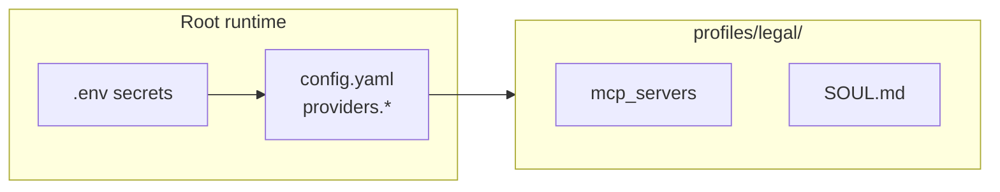

# Checklist: custom inference-provider toevoegen (Windows NL fork)

> **Doel:** een OpenAI-compatibele provider (Venice, Jatevo, eigen endpoint) toevoegen **zonder** hardcoded modellen en **zonder** `providers:` in domein-profielen. Zelfde documentatieniveau als [DOMAIN_BLUEPRINT.md](DOMAIN_BLUEPRINT.md) (domein/profiel) — maar dan alleen voor **inference**, niet voor RAG/SOUL/MCP.

## Wanneer dit document vs. domein-blauwdruk?

| Taak | Document |
|------|----------|
| Nieuw **domeinprofiel** (`legal`, RAG, SOUL, toolsets) | [DOMAIN_BLUEPRINT.md](DOMAIN_BLUEPRINT.md) → optioneel [INSTITUTIONAL_DOMAIN_PLAN.md](INSTITUTIONAL_DOMAIN_PLAN.md) |
| Nieuwe **LLM-provider** (API-key, `/v1/models`, modelkeuze) | **Dit document** |

Providers horen in **root** `%LOCALAPPDATA%\hermes\config.yaml`. Alle profielen erven via [PROFILE_MODEL_INHERITANCE.md](PROFILE_MODEL_INHERITANCE.md).



---

## Checklist (kopieer per provider)

### 1. Verifieer de API

- [ ] OpenAI-compatibel: `GET {base_url}/models` en `POST {base_url}/chat/completions`
- [ ] Juiste **base URL** (voorbeeld Jatevo: `https://jatevo.ai/v1`, niet `https://api.jatevo.ai/v1`)
- [ ] API-key formaat en dashboard-URL genoteerd (bijv. `sk-clb-...` op [jatevo.ai/dashboard](https://jatevo.ai/dashboard))
- [ ] **Geen** vaste modellenlijst in git tenzij upstream dat expliciet vereist

### 2. Repo-template (`docs/templates/`)

- [ ] Kopieer [PROVIDERS_VENICE.yaml](templates/PROVIDERS_VENICE.yaml) of [PROVIDERS_JATEVO.yaml](templates/PROVIDERS_JATEVO.yaml)
- [ ] Hernoem naar `PROVIDERS_<NAAM>.yaml` (hoofdletters)
- [ ] Vul in: `providers.<slug>`, `base_url`, `api_key_env`, `provider: custom`, optioneel `discover_models: true`
- [ ] **Geen** `models:`-blok (live discovery via `/v1/models`)

### 3. Runtime root-config

Bestand: `%LOCALAPPDATA%\hermes\config.yaml` (niet in `profiles\<domein>\`).

```yaml
providers:
  <slug>:
    base_url: https://example.com/v1
    provider: custom
    api_key_env: EXAMPLE_API_KEY
    discover_models: true
```

- [ ] Fragment uit template geplakt onder `providers:`
- [ ] Geen `model:` / `auxiliary:` / `providers:` in profiel-yaml

### 4. Secrets

- [ ] Key in `%USERPROFILE%\.hermes\.env`: `EXAMPLE_API_KEY=...`
- [ ] Sync: `windows\SYNC_HERMES_API_ENV.bat` (runtime + profielen)
- [ ] Controle: key ook in `%LOCALAPPDATA%\hermes\.env` (split-home)

### 5. Gebruiker test (`hermes model`)

- [ ] `hermes model` → provider kiezen → **Keep / Replace / Clear** voor de key
- [ ] Daarna: `Fetching available models...` → lijst uit API (geen config-fallback)
- [ ] Model kiezen; optioneel `/model custom:<slug>:<model-id> --global` in chat

### 6. Optioneel — fork-hardening (alleen bij structurele providers)

- [ ] `JATEVO_API_KEY` (of equivalent) in `windows\sync_hermes_api_env.ps1` statische lijst
- [ ] Doctor: sync-waarschuwing + ontbrekende provider (spiegel Venice/Jatevo in `hermes_cli/doctor.py`)
- [ ] E2E: `Test-Hermes*ProviderConfigured` in `windows/scripts/HermesHomeCommon.ps1` + stap in `HermesHomeE2E.core.ps1` (alleen als provider verplicht is voor jouw omgeving)
- [ ] Unit test: `tests/overlay/test_merge_legacy_providers_config.py` (merge legacy → runtime)

### 7. Documentatie & index

- [ ] [PROFILE_MODEL_INHERITANCE.md](PROFILE_MODEL_INHERITANCE.md) — troubleshooting-regel indien nodig
- [ ] [HERMES_HOME_WINDOWS.md](HERMES_HOME_WINDOWS.md) — één zin onder Venice/Jatevo-sectie
- [ ] [docs/README.md](README.md) — link in “Snel kiezen”
- [ ] [memory-bank/techContext.md](../memory-bank/techContext.md) — korte vermelding (optioneel)

---

## Wat Hermes automatisch doet (geen extra code per provider)

| Gedrag | Waar |
|--------|------|
| Named provider in model picker | `providers.<slug>` → `get_compatible_custom_providers()` |
| Key-stap na providerkeuze | `_prompt_named_custom_api_key` in `hermes_cli/main.py` |
| Persist key → runtime + legacy + actief profiel | `_persist_named_custom_api_key` |
| Live `/v1/models` | `fetch_api_models` — **geen** hardcoded modellenlijst |
| Env-sync dynamisch | `windows/scripts/collect_env_sync_keys.py` leest `api_key_env` uit root config |
| Jatevo dagquota (optioneel) | `agent/jatevo_usage.py` — `GET /v1/usage`; `/jquota` (requests + tokens + cost today); statusbalk `JV used/max`; `/usage` account snapshot |
| Venice DIEM (optioneel) | `agent/venice_usage.py` — balance/rate_limits + `/vquota` (full) / `/usage` (account); `hermes_cli/venice_model_picker.py` — CLI setup + Telegram `vf:*` picker + typed `/model` OpenAI mapping; setup wizard schrijft `extra_body.venice_parameters` |

Geen wijziging in `providers/` Python-packages nodig voor standaard OpenAI-compat endpoints. Quota-UI is **provider-specifiek** (Jatevo `/jquota`, Venice `/vquota`, Gemini `/gquota`).

---

## Veelgemaakte fouten

| Symptoom | Oorzaak | Fix |
|----------|---------|-----|
| 401 op `/v1/models` | Verkeerde `base_url` of ongeldige key | Dashboard + juiste host (zie provider-docs) |
| Key “opgeslagen” maar fetch faalt | Alleen profiel-`.env` vóór fix | Opnieuw Replace; check runtime `.env` |
| Modellen uit config.yaml | Oude fallback (verwijderd in fork) | Alleen live API; geen `models:` in yaml |
| Provider niet in picker | Alleen in profiel-yaml | Verplaats naar **root** config |
| `providers` in `profiles/legal/config.yaml` | Stale kopie | `hermes doctor --fix` |

---

## Referenties

| Onderwerp | Bestand |
|-----------|---------|
| Venice (voorbeeld) | [templates/PROVIDERS_VENICE.yaml](templates/PROVIDERS_VENICE.yaml) |
| Jatevo (voorbeeld) | [templates/PROVIDERS_JATEVO.yaml](templates/PROVIDERS_JATEVO.yaml) |
| Profiel vs. root | [PROFILE_MODEL_INHERITANCE.md](PROFILE_MODEL_INHERITANCE.md) |
| Split-home / sync | [HERMES_HOME_WINDOWS.md](HERMES_HOME_WINDOWS.md) |
| Legacy merge | `windows/scripts/merge_legacy_providers_config.py` |
| Nieuw **domein** (parallel pad) | [DOMAIN_BLUEPRINT.md](DOMAIN_BLUEPRINT.md) |

---

## Credits / dagquota (provider-specifiek)

Hermes toont provider-quota waar geïntegreerd (bijv. `/gquota` voor Gemini). **Jatevo:** **`/jquota`** (dagrequests 0/N, tokens today, cost today), statusbalk **`JV 0/562`**, `GET /v1/usage` (562 = requests/dag, geen dollars). **Venice (DIEM):** statusbalk **`VN …`**; **`/vquota`** (full extended); **`/usage`** (account-scope); modelkeuze via **`hermes model`**, Telegram **`/model`** (`vf:*`), of typed `/model <openai-name> --provider venice`. **`venice_parameters`:** `providers.venice.extra_body` (ook via setup-wizard). Bij **429** → `/vquota`.
