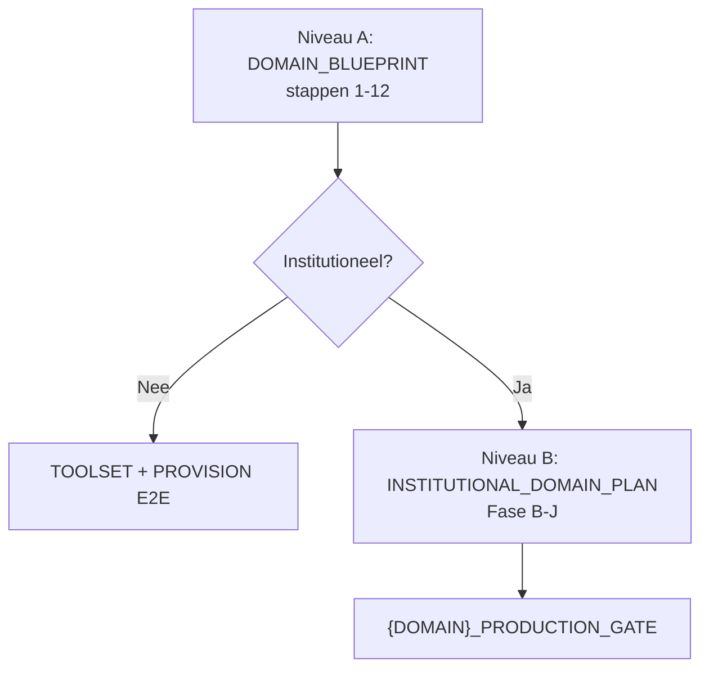
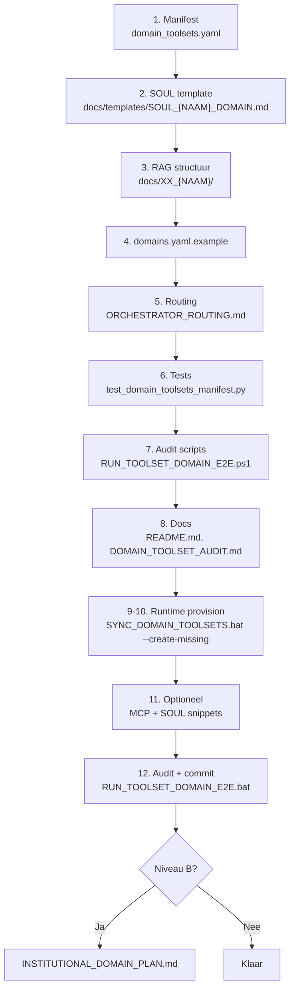

# Blauwdruk: nieuw domein toevoegen aan Hermes-agent (Windows NL fork)

> **Doel:** stap-voor-stap instructie om een nieuw profiel + domein + RAG + SOUL + audit toe te voegen, consistent met de bestaande 14 profielen (laatste standaard: `creative`, map `13_Creative`).

## Twee niveaus

| Niveau | Wanneer | Document |
|--------|---------|----------|
| **A — Standaard** | Nieuw domein met SOUL, toolsets, RAG, routing; weinig subdomeinen; geen zaakdossiers | **Dit document** (stappen 1–12) |
| **B — Institutioneel** | Lenzen + taxonomie, actieve zaken, trust-lagen, dedicated E2E, productie-poort (zoals `legal`) | **[INSTITUTIONAL_DOMAIN_PLAN.md](INSTITUTIONAL_DOMAIN_PLAN.md)** — na stap 12 van Niveau A |

**Parallel (geen domein, wel LLM-provider):** [ADDING_CUSTOM_PROVIDER.md](ADDING_CUSTOM_PROVIDER.md) — Venice/Jatevo/eigen OpenAI-endpoint in root `config.yaml`.

**Referentie Niveau B:** `legal` — architectuur, taxonomie, trust, vier E2E-ketens, [LEGAL_PRODUCTION_GATE.md](LEGAL_PRODUCTION_GATE.md).



---

## Overzicht (Niveau A)



---

## Stap 1: Toolset-manifest (`docs/domain_toolsets.yaml`)

Kopieer een bestaand profielblok en pas aan:

```yaml
  <naam>:
    platform_toolsets:
      cli:
        - mcp
        - file
        - memory
        - skills
        - clarify
        # Voeg passende toolsets toe (zie DOMAIN_TOOLSET_AUDIT.md)
    optional_toolsets:
      # Tools die agent vraagt bij J.
    never_default:
      # Tools die altijd uit blijven
    max_tools: 24  # of lichter
    ask_triggers:
      <tool>: "Wanneer agent vraagt"
    <naam>_lenses:
      <lens>: "Beschrijving"
```

**Regels:**

- `mcp`, `file`, `memory`, `skills`, `clarify` = **verplicht** (basis)
- `code_execution`: alleen aan als het profiel scripts bouwt (dev, security)
- `terminal`: uit voor filosofie/lichte profielen
- `vision`: uit als niet relevant (data)
- `never_default`: altijd `moa` + wat niet past bij domein

---

## Stap 2: SOUL-template (`docs/templates/SOUL_{NAAM}_DOMAIN.md`)

Kopieer `SOUL_LEGAL_DOMAIN.md` of `SOUL_ICT_DOMAIN.md` en vervang:

| Sectie | Inhoud |
|--------|--------|
| **Identity** | Wat is deze agent? (bijv. "juridische assistent", "security assessor") |
| **Mission** | Wat doet het profiel? |
| **Lenzen** | Subdomeinen met signaalwoorden en bron-submappen |
| **Autonomy** | Mag zonder toestemming / Mag NIET zonder toestemming |
| **Forensic & trust** | Wanneer `search_knowledge` verplicht |
| **Optionele tools** | Standaard uit — vraag J. |
| **Standards** | `[Bron: ...]` formaat |
| **Tone** | Privé vs publiek |

**Belangrijk:** Geen zaaknaam/dossiernummer in Identity; lopende zaken in `<NAAM>_ACTIVE_MATTERS.md` (Niveau B: verplicht — zie [INSTITUTIONAL_DOMAIN_PLAN.md](INSTITUTIONAL_DOMAIN_PLAN.md) Fase C).

**Niveau B extra:** parallelle invalshoeken, USER.md-precedence, meta-slash — zie institutioneel plan Fase B3.

---

## Stap 3: RAG-bronstructuur (`docs/XX_{NAAM}/`)

Maak map + README + submappen:

```
docs/XX_<NAAM>/
  README.md          # Index: lenzen, bronmappen, governance
  ONBOARDING.md      # Wanneer te gebruiken, tool governance, escalation pad
  PROCEDURES.md      # SOP's per lens
  ESCALATION.md      # Escalatie matrix naar andere profielen
  <Lens1>/           # Bronbestanden (docs, configs, procedures)
  <Lens2>/
  ...
```

**Nummering:** `XX` = volgnummer na laatste domein (nu: 13 = Creative, dus volgende = 14).

**Optioneel (Niveau B):** `docs/<naam>/_Taxonomy/README.md` + aparte `{DOMAIN}_TAXONOMY.md` in `docs/`.

---

## Stap 4: `domains.yaml.example`

Voeg toe onder `domains:`:

```yaml
  - name: <naam>
    source_dir: XX_<Naam>
    description: Korte omschrijving
    lancedb_path: ~/data/lancedb/<naam>
    mcp_name: lancedb-<naam>
    profile_name: <naam>
    # Optioneel: ingest_env, media_policy
```

---

## Stap 5: Core-routing (`docs/ORCHESTRATOR_ROUTING.md`)

Voeg toe aan routing-matrix:

```markdown
| <Signaalwoorden> | `<naam>` | `lancedb-<naam>` |
```

En in `SOUL_CORE_ORCHESTRATOR.md` (template):

```markdown
| <Signaalwoorden> | `<naam>` |
```

---

## Stap 6: Tests uitbreiden (`tests/windows/test_domain_toolsets_manifest.py`)

Voeg toe aan `REQUIRED_PROFILES`:

```python
"<naam>",
```

Voeg lens-test toe:

```python
def test_<naam>_has_lenses():
    data = _load()
    prof = (data.get("profiles") or {}).get("<naam>") or {}
    lenses = prof.get("<naam>_lenses") or {}
    assert "<lens1>" in lenses
    assert "<lens2>" in lenses
```

Voeg SOUL-template test toe:

```python
def test_soul_templates_exist():
    # bestaande asserts
    assert (REPO / "docs/templates/SOUL_<NAAM>_DOMAIN.md").is_file()
```

**Niveau B:** extra pytest-pakketten — zie [INSTITUTIONAL_DOMAIN_PLAN.md](INSTITUTIONAL_DOMAIN_PLAN.md) Fase E.

---

## Stap 7: Audit-scripts

### `windows/audits/RUN_TOOLSET_DOMAIN_E2E.ps1`

- Algemene check: werkt automatisch (loopt over alle profielen in manifest)
- SOUL-governance stap: voeg `<naam>` toe aan de lijst in stap 6/6

### `windows/audits/RUN_INSTITUTIONAL_E2E.ps1`

- Voeg `docs/templates/SOUL_<NAAM>_DOMAIN.md` toe aan `$requiredRepo`
- Optioneel (Niveau B): `{DOMAIN}_TAXONOMY.md`, `{DOMAIN}_DOMAIN_ARCHITECTURE.md`

### `windows/HermesCriticalWindowsRepoPaths.ps1`

- Voeg toe aan `Get-HermesCriticalWindowsRepoPaths`

**Niveau B:** dedicated `RUN_<DOMAIN>_DOMAIN_E2E` + verify-scripts — inventaris in institutioneel plan § Legal referentie.

---

## Stap 8: Documentatie bijwerken

| Bestand | Wat bijwerken |
|---------|---------------|
| `docs/README.md` | Index-regel toevoegen |
| `docs/PROFILE_SOUL.md` | Koppeling domein → profiel → SOUL |
| `docs/DOMAIN_TOOLSET_AUDIT.md` | Profiel-tabel toevoegen |
| `memory-bank/activeContext.md` | Focus beschrijven |
| `memory-bank/progress.md` | Todo afvinken |
| `memory-bank/systemPatterns.md` | Patroon documenteren |
| `memory-bank/productContext.md` | Team-lijst uitbreiden |

**Niveau B:** `{DOMAIN}_PRODUCTION_GATE.md`, `{DOMAIN}_ROLLOUT_CHECKLIST.md` — zie institutioneel plan Fase I.

---

## Stap 9–10: Runtime provision + toolset-sync

Zet altijd `HERMES_HOME` op de **root** (niet `profiles\legal`):

```cmd
set HERMES_HOME=%LOCALAPPDATA%\hermes
windows\SYNC_DOMAIN_TOOLSETS.bat --create-missing
```

Dit script:

1. Maakt ontbrekende profielen aan (`profiles\<naam>\`, submappen, minimale `config.yaml`, `SOUL.md` uit `docs/templates/SOUL_<NAAM>_DOMAIN.md` met inline shared snippets).
2. Schrijft `platform_toolsets.cli` uit `docs/domain_toolsets.yaml`.

**Optioneel daarna:**

```cmd
python scripts\rag_pipeline\sync_profile_mcp_from_domains.py --domains-yaml docs\domains.yaml.example
windows\SYNC_DOMAIN_TOOLSETS.bat --create-missing --sync-soul-snippets
```

Of alleen snippets: `windows\SYNC_SOUL_SNIPPETS.bat`.

**Nieuwe chat** per profiel na sync.

Smoke-test provision: `windows\audits\RUN_PROVISION_DOMAIN_E2E.bat`

**Niveau B na provision:** `SYNC_TRUST_RUNTIME.bat`, `VERIFY_<DOMAIN>_RUNTIME.bat`, layout-migratie vóór ingest.

---

## Stap 11: Optioneel — dedicated domein-E2E (Niveau A+)

Voor een **standaard** maar volledig gedocumenteerd 14e domein (voorbeeld `creative`):

| Artefact | Pad |
|----------|-----|
| README | `audits/CREATIVE_DOMAIN_E2E_README.md` |
| Harness | `audits/CreativeDomainE2E.harness.py` |
| Runner | `audits/RUN_CREATIVE_DOMAIN_E2E.bat` |

Dit is **lichter** dan Niveau B (`legal`). Geen trust-lagen of production gate vereist.

---

## Stap 12: Audit draaien + commit

```cmd
windows\audits\RUN_TOOLSET_DOMAIN_E2E.bat
```

Verwacht: **PASS** (alle profielen, root = 0 tools).

**Daarna Niveau B?** → [INSTITUTIONAL_DOMAIN_PLAN.md](INSTITUTIONAL_DOMAIN_PLAN.md) volledig doorlopen vóór productie.

```cmd
git add docs/ tests/ windows/ memory-bank/
git commit -m "feat(<naam>): nieuw domeinprofiel + SOUL + RAG + audit"
git push origin main
```

**Fork CI:** op `hermes-agent-windows-nl` draait upstream **Tests** (Linux) niet; poort = **Fork Windows Institutional** + lokale domein-E2E. Zie [README-FORK.md](../README-FORK.md) § CI.

---

## Voorbeeld: legal (Niveau B referentie)

```yaml
# domain_toolsets.yaml
  legal:
    platform_toolsets:
      cli: [mcp, file, memory, skills, clarify, web, terminal, browser]
    optional_toolsets: [vision, session_search, todo]
    never_default: [delegation, code_execution, kanban, moa]
    max_tools: 24
    legal_lenses:
      arb: "vision bij scan"
      bbk: "web_extract voor URL"
```

```markdown
# SOUL_LEGAL_DOMAIN.md
## Identity
Juridische domein-assistent van J.
## Mission
Onderzoek, structureren, citeren per juridische lens.
## Juridische lenzen
| Signaal | Lens | Bron-submap |
|---------|------|-------------|
| arbeidsrecht, cao | Arbeidsrechtelijk | `Arbeidsrecht/` |
```

Volledige legal-stack: [INSTITUTIONAL_DOMAIN_PLAN.md](INSTITUTIONAL_DOMAIN_PLAN.md) § Legal referentie.

---

## Checklist — Niveau A

- [ ] `domain_toolsets.yaml` — profiel toegevoegd
- [ ] `SOUL_<NAAM>_DOMAIN.md` — template geschreven
- [ ] `docs/XX_<NAAM>/` — mappen + README + ONBOARDING + PROCEDURES + ESCALATION
- [ ] `domains.yaml.example` — entry toegevoegd
- [ ] `ORCHESTRATOR_ROUTING.md` — routing regel toegevoegd
- [ ] `SOUL_CORE_ORCHESTRATOR.md` — routing bijgewerkt
- [ ] `test_domain_toolsets_manifest.py` — profiel + lenses + SOUL test
- [ ] `RUN_INSTITUTIONAL_E2E.ps1` — SOUL template in `$requiredRepo`
- [ ] `HermesCriticalWindowsRepoPaths.ps1` — kritieke paden
- [ ] `README.md` — index-regel
- [ ] `PROFILE_SOUL.md` — koppeling
- [ ] `DOMAIN_TOOLSET_AUDIT.md` — profiel-tabel
- [ ] Memory-bank — bijgewerkt
- [ ] Runtime profiel-map + config.yaml + SOUL.md aangemaakt
- [ ] `SYNC_DOMAIN_TOOLSETS.bat --create-missing` gedraaid
- [ ] MCP sync gedraaid (optioneel)
- [ ] SOUL snippets gesynced (optioneel)
- [ ] `RUN_TOOLSET_DOMAIN_E2E.bat` — PASS
- [ ] Git commit + push

## Checklist — Niveau B (na A)

→ [INSTITUTIONAL_DOMAIN_PLAN.md](INSTITUTIONAL_DOMAIN_PLAN.md) — **Master-checklist** (architectuur, taxonomie, trust, E2E, production gate, deploy-keten).

---

## Veelgemaakte fouten

1. **Model in profiel config** → Verwijder `model:` blok; model staat in root `config.yaml`
2. **Lenzen als apart profiel** → Nee; lenzen zijn **subdomeinen** binnen één profiel (zie `legal`)
3. **Security als lens onder `ict`** → Nee; security is **apart profiel** vanwege governance-risico
4. **SOUL wijzigen zonder nieuwe chat** → Tools laden pas bij sessiestart
5. **RAG bronnen vergeten** → Lege LanceDB = lege index; altijd bronnen plaatsen vóór ingest
6. **Niet commit/push na manifest-wijziging** → SYNC leest uit repo; runtime drift bij git pull
7. **Niveau B overslaan bij legal-achtig domein** → Geen `{DOMAIN}_PRODUCTION_GATE` = geen release-discipline
8. **GitHub Tests-workflow als fork-poort** → Gebruik Fork Windows Institutional + lokale E2E

---

## Gerelateerde documenten

| Document | Waarvoor |
|----------|----------|
| [**INSTITUTIONAL_DOMAIN_PLAN.md**](INSTITUTIONAL_DOMAIN_PLAN.md) | **Niveau B** — volledig plan (legal als referentie) |
| [`DOMAIN_TOOLSET_AUDIT.md`](DOMAIN_TOOLSET_AUDIT.md) | Toolset-verdeling per profiel |
| [`PROFILE_SOUL.md`](PROFILE_SOUL.md) | SOUL.md locatie en bewerken |
| [`ORCHESTRATOR_ROUTING.md`](ORCHESTRATOR_ROUTING.md) | Core routing matrix |
| [`domains.yaml.example`](domains.yaml.example) | RAG configuratie sjabloon |
| [`LEGAL_PRODUCTION_GATE.md`](LEGAL_PRODUCTION_GATE.md) | Voorbeeld productie-poort |
| [`LEGAL_ROLLOUT_CHECKLIST.md`](LEGAL_ROLLOUT_CHECKLIST.md) | Voorbeeld rollout |
| [`../audits/CREATIVE_DOMAIN_E2E_README.md`](../audits/CREATIVE_DOMAIN_E2E_README.md) | Niveau A+ dedicated E2E |
| [`../windows/audits/README.md`](../windows/audits/README.md) | Audit runners |
| [`../memory-bank/systemPatterns.md`](../memory-bank/systemPatterns.md) | Architectuurpatronen |
| [`../README-FORK.md`](../README-FORK.md) | Fork CI-notificaties |
| [`../skills/productivity/create_fork_domain/SKILL.md`](../skills/productivity/create_fork_domain/SKILL.md) | Agent-checklist |
