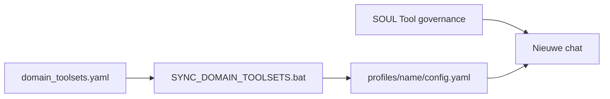

# Domein-toolset audit (built-in + opt-in)

Operationele handleiding: welke Hermes-toolsets per profiel standaard aan staan, welke **optioneel** (agent vraagt J.), en hoe je inschakelt.

| Document | Rol |
|----------|-----|
| [domain_toolsets.yaml](domain_toolsets.yaml) | Machine-leesbare bron (sync naar runtime) |
| [ORCHESTRATOR_ROUTING.md](ORCHESTRATOR_ROUTING.md) | Core → specialist-profiel |
| [LEGAL_DOMAIN_ARCHITECTURE.md](LEGAL_DOMAIN_ARCHITECTURE.md) | Legal: één profiel, meerdere lenzen |
| [LEGAL_TAXONOMY.md](LEGAL_TAXONOMY.md) | Lenzen arb/bbk/aanspr/klok/corp |
| [PROFILE_MODEL_INHERITANCE.md](PROFILE_MODEL_INHERITANCE.md) | Model in root; toolsets in profiel |

## Architectuur



- **Legal subdomeinen** (lenzen) hebben **geen** aparte `platform_toolsets` — zelfde toolbox als profiel `legal`.
- **Mid-sessie:** tools worden niet dynamisch toegevoegd. Na goedkeuring: `hermes -p <profiel> tools` → **nieuwe chat**.

## Inschakelen (altijd hetzelfde)

1. Agent meldt welke toolset ontbreekt en waarom.
2. J. draait: `hermes -p <profiel> tools` (of bewerkt `platform_toolsets.cli` in profiel-`config.yaml`).
3. **Nieuwe chat** in dat profiel.
4. Optioneel: `windows\SYNC_DOMAIN_TOOLSETS.bat` na git pull (zet manifest terug als handmatige drift).

## Toolset → tools (referentie)

| Toolset | Belangrijkste tools |
|---------|-------------------|
| mcp | `search_knowledge`, … (per `lancedb-<domein>`) |
| file | `read_file`, `write_file`, `patch`, `search_files` |
| memory | `memory` |
| skills | `skills_list`, `skill_view`, `skill_manage` |
| clarify | `clarify` |
| web | `web_search`, `web_extract` |
| search | `web_search` alleen (lichter) |
| terminal | `terminal`, `process` |
| browser | `browser_*`, `web_search` |
| todo | `todo` |
| kanban | `kanban_*` (core) |
| vision | `vision_analyze` |
| session_search | `session_search` |
| delegation | `delegate_task` |
| code_execution | `execute_code` |

Zie upstream `toolsets.py` / `hermes chat --list-toolsets`.

---

## Root (`%LOCALAPPDATA%\hermes\config.yaml`)

| Instelling | Waarde |
|------------|--------|
| `platform_toolsets.cli` | `[]` (leeg, **expliciet** — geen `hermes-cli` fallback) |
| `toolsets` | `[]` (override DEFAULT_CONFIG `hermes-cli`) |

Profiel-`config.yaml` is leidend voor CLI-chat (`hermes -p legal`). Zonder `-p` heeft root bijna geen tools — gebruik altijd een domeinprofiel.

---

## Profiel: core (orchestrator)

| Toolset | Standaard | Optioneel | Uit |
|---------|-----------|-----------|-----|
| mcp, file, memory, skills, clarify | Aan | | |
| web, terminal, browser | Aan | | |
| kanban, todo | Aan | | |
| delegation | | Vraag J. | |
| session_search | | Vraag J. | |
| hermes-cli, moa, image_gen, cronjob | | | Uit |

**Agent vraagt wanneer**

| Toolset | Trigger |
|---------|---------|
| delegation | Geïsoleerde subagent voor zware deeltaak |
| session_search | Eerdere core-sessies doorzoeken |

**Max tools (richtlijn):** ≤ 22

---

## Profiel: legal (+ lenzen arb, bbk, aanspr, klok, corp)

| Toolset | Standaard | Optioneel | Uit |
|---------|-----------|-----------|-----|
| mcp, file, memory, skills, clarify | Aan | | |
| web, terminal, browser | Aan (behoud huidige setup) | | |
| vision, session_search, todo | | Vraag J. | |
| delegation, code_execution, kanban, moa | | | Uit |

### Per lens (gedrag, geen config-wijziging)

| Lens | Extra “vraag om tool” |
|------|------------------------|
| arb / zaak-GCR | vision bij scans; session_search voor eerdere strategie |
| bbk | web_extract voor besluit-URL's |
| klok | browser als meldloket JS-only (browser al standaard) |
| aanspr | vision bij schade-foto's |
| corp | vision bij contract-scans |

**Max tools:** ≤ 18

---

## Profiel: academics

| Standaard | Optioneel | Uit |
|-----------|-----------|-----|
| mcp, file, memory, skills, clarify, web, terminal, browser | vision | delegation, kanban, code_execution |

**Vraag vision wanneer:** figuren in papers buiten RAG-tekst.

---

## Profiel: trading

| Standaard | Optioneel | Uit |
|-----------|-----------|-----|
| mcp, file, memory, skills, clarify, web, terminal, browser | code_execution, vision | delegation, kanban |

---

## Profiel: operations

| Standaard | Optioneel | Uit |
|-----------|-----------|-----|
| mcp, file, memory, skills, clarify, web, terminal, browser, todo | delegation | kanban |

---

## Profiel: logistics

| Standaard | Optioneel | Uit |
|-----------|-----------|-----|
| mcp, file, memory, skills, clarify, web, browser | terminal | delegation, code_execution |

**Lichter:** geen terminal standaard; `search` kan via manifest worden gebruikt — huidige manifest: `web`+`browser`.

---

## Profiel: philosophy

| Standaard | Optioneel | Uit |
|-----------|-----------|-----|
| mcp, file, memory, skills, clarify, **search** | web | terminal, browser, delegation |

---

## Profiel: gaming

| Standaard | Optioneel | Uit |
|-----------|-----------|-----|
| mcp, file, memory, skills, clarify, web, browser | vision | cronjob, homeassistant |

---

## Profiel: ventures

| Standaard | Optioneel | Uit |
|-----------|-----------|-----|
| mcp, file, memory, skills, clarify, web, terminal, browser, todo | code_execution | delegation, image_gen |

---

## Profiel: ict (+ lenzen infra, devops, support, sysadmin)

|| Standaard | Optioneel | Uit |
||-----------|-----------|-----|
|| mcp, file, memory, skills, clarify, web, terminal, browser | vision, session_search, todo, kanban | delegation, code_execution, moa |

**Vraag optioneel wanneer:**
- `vision`: Screenshot van error/UI of gescande netwerkdiagrammen
- `session_search`: Eerdere troubleshooting-sessies terugvinden
- `todo`: Meerstaps incident of change-planning
- `kanban`: Ticket-board beheer voor ITIL/change processen

**Governance:** Productie wijzigingen altijd J.-goedkeuring.

---

## Profiel: security (+ lenzen pentest, compliance, incident, forensics)

|| Standaard | Optioneel | Uit |
||-----------|-----------|-----|
|| mcp, file, memory, skills, clarify, web, terminal, browser, **code_execution** | vision, session_search, todo, delegation | moa, image_gen, video_gen |

**Vraag optioneel wanneer:**
- `vision`: CVE dashboard screenshots
- `session_search`: Eerdere pentest/audit sessies
- `todo`: Incident-response checklist
- `delegation`: Crisis-response (parallel forensics + communicatie)

**Governance:** Impact op productie vereist expliciete J.-goedkeuring per actie. Chain of custody bij forensics.

---

## Profiel: dev (+ lenzen backend, frontend, architecture, quality)

|| Standaard | Optioneel | Uit |
||-----------|-----------|-----|
|| mcp, file, memory, skills, clarify, web, terminal, browser, **code_execution** | vision, session_search, todo, kanban | delegation, moa, image_gen |

**Vraag optioneel wanneer:**
- `vision`: UI screenshots voor bug-reports
- `session_search`: Eerdere debug/architecture sessies
- `todo`: Sprint planning
- `kanban`: Development workflow tickets

**Governance:** Geen productie deploy zonder J.-goedkeuring.

---

## Profiel: data (+ lenzen database, analytics, pipeline, governance)

|| Standaard | Optioneel | Uit |
||-----------|-----------|-----|
|| mcp, file, memory, skills, clarify, web, terminal, browser | code_execution, session_search, todo | delegation, moa, image_gen, vision |

**Vraag optioneel wanneer:**
- `code_execution`: ETL scripts testen in sandbox
- `session_search`: Eerdere data modeling sessies
- `todo`: Data migration checklist

**Governance:** Schema wijzigingen / data exports altijd J.-goedkeuring. PII altijd maskeren in non-prod.

---

## Sync en verify

```cmd
set HERMES_HOME=%LOCALAPPDATA%\hermes
windows\SYNC_DOMAIN_TOOLSETS.bat
windows\SYNC_DOMAIN_TOOLSETS.bat --create-missing
windows\audits\RUN_TOOLSET_DOMAIN_E2E.ps1
windows\audits\RUN_PROVISION_DOMAIN_E2E.bat
hermes -p legal chat --list-tools
```

**`--create-missing`:** voor elk profiel in `domain_toolsets.yaml` zonder `profiles/<naam>/config.yaml` — mapstructuur, minimale config, SOUL uit template (inline shared snippets). Bestaande profielen: alleen toolset-sync.

| Flag | Gedrag |
|------|--------|
| `--create-missing` | Provision + sync |
| `--provision-only` | Alleen aanmaken, geen toolset-wijziging |
| `--clone-from legal` | SOUL-fallback als domein-template ontbreekt |
| `--sync-soul-snippets` | Na sync: `SYNC_SOUL_SNIPPETS.bat` (alle profielen) |
| `--check` | Drift detectie (vóór apply in script) |

Altijd `HERMES_HOME` op root (`%LOCALAPPDATA%\hermes`), niet `profiles\legal`.

**Rooktest (nieuwe chat):**

> Welke tools en toolsets heb je? Welke tool zou je voor [taak] nodig hebben — staat die aan?

Verwacht: agent noemt alleen ingeschakelde tools; bij ontbrekende optionele tool → korte instructie `hermes -p legal tools` + nieuwe chat.

## Profiel: creative

| Standaard | Optioneel | Uit |
|-----------|-----------|-----|
| mcp, file, memory, skills, clarify, web, browser, **terminal** | image_gen, vision, code_execution | moa, cronjob, delegation, homeassistant |

**Lenzen:** visual, motion, interactive, writing (`creative_lenses` in manifest).

**Skills:** `fork_creative_skills` — o.a. manim-video (bundled), hyperframes (optional install), comfyui, excalidraw. Hyperframes vereist `terminal` + `hermes skills install official/creative/hyperframes`.

**Vraag optioneel wanneer:**
- `image_gen`: nieuwe illustratie of social asset
- `vision`: mockup/screenshot feedback
- `code_execution`: p5js/comfy test in sandbox

## Token-impact (indicatief)

| Setup | Schema-tokens/turn (ruw) |
|-------|-------------------------|
| `hermes-cli` op root | ~10k+ |
| legal na sync (browser aan, ~21 tools incl. MCP) | ~5–7k |
| hermes-cli preset (referentie) | ~27+ tools |
| philosophy (search, geen browser) | ~4–5k |

Skills-index krimpt mee wanneer zware toolsets uit staan (`requires_toolsets` in skills).

## Beperking

Hermes laadt tool-schema's bij **sessiestart**. Geen dynamische activatie midden in een chat — daarom altijd **nieuwe chat** na `hermes tools`.
