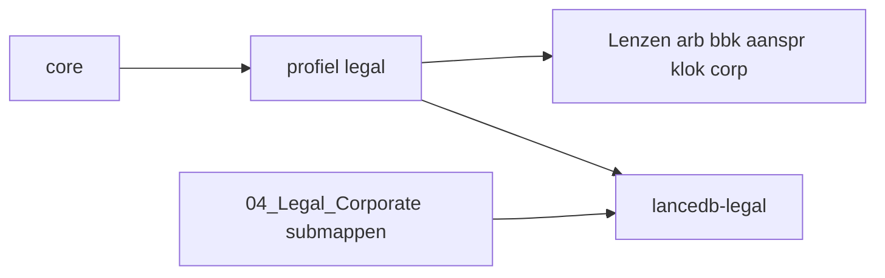

# Legal domein — architectuur (institutioneel)

## Overzicht

| Laag | Component | Pad / naam |
|------|-----------|------------|
| Top | Core orchestrator | `profiles/core` → routeert juridisch naar `legal` |
| Domein | Profiel `legal` | `%LOCALAPPDATA%\hermes\profiles\legal\` |
| RAG | Eén bucket | `%USERPROFILE%\data\lancedb\legal\`, MCP `lancedb-legal` |
| Bronnen | Eén source_dir | `%USERPROFILE%\data\raw_source_files\04_Legal_Corporate\` |
| Rechtsgebieden | **Lenzen** in SOUL | Taxonomie: [LEGAL_TAXONOMY.md](LEGAL_TAXONOMY.md) |
| Lopende zaken | Buiten Identity | `profiles\legal\LEGAL_ACTIVE_MATTERS.md` |



## Waarom één bucket?

Overlappende zaken (bijv. GCR: arbeidsrecht + bestuursrecht + klokkenluiders) blijven **cross-searchbaar** in één LanceDB. Lenzen bepalen **hoe** je antwoordt en labelt, niet welke index je doorzoekt.

## Lenzen vs. Hermes-profielen

| Mechanisme | Wanneer |
|------------|---------|
| **Lens** (standaard) | Nieuw rechtsgebied; zelfde Autonomy-stijl; overlap met bestaande zaken |
| **Aparte profiel** (fase 3b) | Zie split-criteria in [LEGAL_TAXONOMY.md](LEGAL_TAXONOMY.md) |

Er zijn **geen** geneste profielen (`profiles/legal/arbeidsrecht`) in Hermes — alleen platte siblings onder `profiles/`.

## Binnen-routering (legal)

Core stuurt naar `legal`. Het profiel `legal` kiest intern een of meer lenzen via de tabel in SOUL.md. Bij overlap: **beide lenzen labelen** in het antwoord.

Core routeert **niet** naar `legal-arb` of `klokkenluiders` tenzij fase 3b is geactiveerd.

## Actieve zaken vs. rechtsgebied

| Type | Voorbeeld | Waar |
|------|-----------|------|
| Rechtsgebied-lens | Arbeidsrechtelijk | SOUL + submap |
| Lopende zaak | GCR 2024-00145 | `LEGAL_ACTIVE_MATTERS.md` + map `Geschillencommissie Rijk/` |

Zaak-specifieke strategie, speerpunten en terminologie horen **niet** in SOUL Identity/Mission.

Optioneel per zaak in `LEGAL_ACTIVE_MATTERS.md`: **Adjacent checks** (mandaat, procedure, P-Direkt vs arb, enz.) — de agent gebruikt die bij strategievraag.

## Taal- en triggerlagen (100% — geen i18n)

Hermes legal gebruikt **taal per laag**, niet vertaalde dubbele bestanden.

| Laag | Bestand | Taal | Wat erin hoort |
|------|---------|------|----------------|
| A — Trust | `profiles/legal/memories/USER.md` (eerste §) | **EN** | Forensisch gedrag, tool-failures (fork-breed seed) |
| B — Domein-triggers | `profiles/legal/memories/USER.md` (legal §) | **NL** | Signaal→actie, voorbeeldvragen J. (mandaat, disciplinair, GCR/VSO) |
| C — Gedrag | `profiles/legal/SOUL.md` | **NL** | Tone B1, parallelle invalshoeken, lenzen, hard limits |
| D — Zaak | `profiles/legal/LEGAL_ACTIVE_MATTERS.md` | **NL** | Adjacent checks per dossier |

**Regels**

1. USER **triggert**; SOUL **beschrijft**; MATTERS **zaak** — geen volledige SOUL-procedures in USER kopiëren.
2. Bij conflict USER ↔ SOUL: **SOUL prevaleert** (staat in seed + SOUL template).
3. Geen `USER.nl.md` / i18n-framework — tenzij later een apart profiel `legal-en` voor andere gebruikers.
4. Char-budget: legal `USER.md` ~1800 tekens totaal; triggers compact houden (`enforce_profile_memory_char_limits.ps1`).

**Sync:** `docs/templates/MEMORY_CANONICAL_SEED.md` sectie `legal USER.md entries` (3 §-entries) → `sync_profile_memories.ps1` alleen voor `profiles/legal/memories/USER.md`.

**Verificatie:** `audits/RUN_LEGAL_MEMORY_LANGUAGE_LAYERS_E2E.bat` (taal-lagen); `audits/RUN_LEGAL_PROACTIVE_SPARRING_E2E.bat` (breed); `pytest tests/windows/test_legal_memory_language_layers.py`.

## Proactief meedenken (antwoordstructuur)

| Onderdeel | Waar |
|-----------|------|
| **`### Parallelle invalshoeken`** | `SOUL_LEGAL_DOMAIN.md` + runtime SOUL; tabel *Invalshoek \| Waarom relevant \| Status* |
| Gap-blok per strategie | Shared Values (`Ontbrekende informatie`) |
| Legal USER seed (NL triggers) | `MEMORY_CANONICAL_SEED.md` → `profiles/legal/memories/USER.md` via `SYNC_TRUST_RUNTIME.bat` |
| Voorbeeldvragen J. | Zelfde seed (`Legal triggers — voorbeeldvragen J. (NL)`) |
| Compact modus | `<institutional_check>` mag weg; parallelle sectie **niet** bij materieel strategiewerk (`SOUL_SHARED_OUTPUT_FORMAT.md`) |

Voorbeeld: vraag over disciplinaire straffen → parallelle invalshoeken + expliciet mandaat oplegger (USER-trigger + SOUL-sectie).

## Mapconventies

```
%USERPROFILE%\data\raw_source_files\04_Legal_Corporate\
  Arbeidsrecht\
  Bestuursrecht\
  Aansprakelijkheid_Letselschade\
  Klokkenluiders\
  Corporate\
  Geschillencommissie Rijk\    # zaak, geen lens
  _Taxonomy\README.md
```

Migratie: `windows\scripts\migrate_legal_source_layout.ps1` (eenmalig, dry-run standaard).

## Ingest

- Eén domein in `domains.yaml`: `name: legal`, `source_dir: 04_Legal_Corporate`
- Commando: `windows\scripts\update_knowledge.bat legal`
- **Niet** parallel met zware Kanban-jobs op dezelfde LanceDB (lock-risico)

Optioneel later (fase 2b): metadata `legal_lens` in ingest — alleen als mappen onvoldoende zijn voor filtering.

## Fase 3b — split naar profiel `klokkenluiders`

| Onderdeel | Actie |
|-----------|--------|
| `domains.yaml` | Entry `09_Klokkenluiders` (of `10_…`) |
| Profiel | `hermes profile create klokkenluiders --clone legal` |
| Routing | [ORCHESTRATOR_ROUTING.md](ORCHESTRATOR_ROUTING.md) + core-SOUL |
| RAG | Gedeelde `lancedb-legal` (read-only MCP) **of** aparte index — documenteer keuze in user `domains.yaml` |

## Templates en runtime

| Bestand | Rol |
|---------|-----|
| [templates/SOUL_LEGAL_DOMAIN.md](templates/SOUL_LEGAL_DOMAIN.md) | Repo-referentie generieke legal-SOUL |
| `profiles\legal\SOUL.md` | Runtime (buiten git) |
| `profiles\legal\LEGAL_ACTIVE_MATTERS.md` | Lopende dossiers (buiten git) |

### Automatische sync (P2)

| Trigger | Actie |
|---------|--------|
| `launch_soul_anatomy_deploy.ps1` (Hermes-start, UPDATE post-merge) | `sync_all_domain_souls` → **`sync_legal_lens_from_taxonomy.ps1 --all`** (template + runtime) |
| Wijziging `docs/LEGAL_TAXONOMY.md` | Stamp soul-deploy invalid → volgende start pusht lenzentabel |
| Handmatig | `windows\SYNC_LEGAL_LENS_FROM_TAXONOMY.bat` |
| Overslaan | `HERMES_SKIP_LEGAL_LENS_SYNC=1` |

Na deploy met gewijzigde SOUL: **`/new`** in lopende chat (system prompt).

### Verificatie (productie)

| Script | Doel |
|--------|------|
| `windows\VERIFY_LEGAL_RUNTIME.bat` | Snel: SOUL meta, parity, domains.yaml (warn of strict) |
| `windows\audits\RUN_LEGAL_DOMAIN_E2E.bat` | Volledige poort (12 stappen) |
| `scripts\rag_pipeline\verify_legal_lens_parity.py` | SOUL-tabel == taxonomie (≠ RAG-filter; zie [LEGAL_INGEST_METADATA.md](LEGAL_INGEST_METADATA.md)) |
| `windows\scripts\ensure_legal_active_matters.ps1` | Seed `LEGAL_ACTIVE_MATTERS.md` (nooit overschrijven) |
| `audits\RUN_LEGAL_PROACTIVE_SPARRING_E2E.bat` | Template + repair + runtime parallelle invalshoeken / 1× Config governance |

Matrix: [LEGAL_PRODUCTION_GATE.md](LEGAL_PRODUCTION_GATE.md). Chat: `/legal-architectuur`.

## Fork-skills (web + parsing, in repo)

Naast RAG (`search_knowledge` op `lancedb-legal`) zijn drie **CLI-skills** beschikbaar voor live zoeken en documentextractie (geen API-key voor rechtspraak.nl HTML):

| Skill | Pad | Typisch gebruik |
|-------|-----|-----------------|
| `rechtspraak-zoeken` | `skills/legal/rechtspraak-zoeken/` | Uitspraken vinden, ECLI/URL uit resultaten |
| `uitspraak-parseren` | `skills/legal/uitspraak-parseren/` | XML via ECLI of stdin; DOCX/PDF lokaal |
| `web-research-legal` | `skills/legal/web-research-legal/` | `site:wetten.nl` / meerdere sites via Google HTML |

Manifest: `docs/domain_toolsets.yaml` → `legal.fork_legal_skills`. Conventies voor scripts/data: [WORKSPACE_CONVENTIONS.md](WORKSPACE_CONVENTIONS.md).

**Unit tests:** `pytest tests/skills/test_rechtspraak_zoeken_skill.py tests/skills/test_uitspraak_parseren_skill.py tests/skills/test_web_research_legal_skill.py` (101 tests, gemockte HTTP)

## Audits

| Script | Doel |
|--------|------|
| `windows\audits\RUN_LEGAL_DOMAIN_E2E.bat` | Taxonomie, SOUL-structuur, submappen, rooktest |
| `windows\audits\RUN_AUDITS.bat -IncludeLegalDomainE2E` | Gecombineerde poort |
| `audits\RUN_REPO_HYGIENE_E2E.bat` | Guard, skills importeerbaar, `fork_legal_skills` in manifest |
| `audits\RUN_INSTITUTIONAL_HARDENING_E2E.bat` | Geïntegreerde poort: QuickFix-flow + pytest + preflight guard-log (14/14) |

## Zie ook

- [LEGAL_TAXONOMY.md](LEGAL_TAXONOMY.md)
- [PROFILE_SOUL.md](PROFILE_SOUL.md)
- [ORCHESTRATOR_ROUTING.md](ORCHESTRATOR_ROUTING.md)
- [RAG_TWEE_FASEN.md](RAG_TWEE_FASEN.md)
