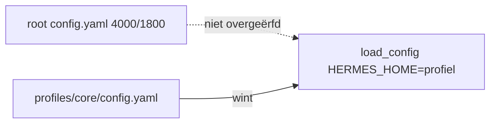

# Memory-architectuur (Windows fork)

Operationele samenvatting; vault-details staan in `Documents/Hermes Knowledge/README.md`.

## Aanbevolen stack

- **L1** — `MEMORY.md` / `USER.md` per profiel (trust limits 4000/1800)
- **L2** — FTS5 `state.db` (`session_search`)
- **L3** — **uit** op productie-profielen (geen Honcho/Mem0)
- **L4** — Obsidian vault = `Hermes Knowledge` (`OBSIDIAN_VAULT_PATH`)
- **RAG** — LanceDB per domein voor bronnen
- **SOUL** — gedrag per profiel

## Env (canoniek)

Bron van waarheid: `%USERPROFILE%\.hermes\.env` (voorbeeldregels: [templates/MEMORY_ENV_VAULT.example](templates/MEMORY_ENV_VAULT.example)). Daarna sync naar runtime:

```bat
windows\SYNC_HERMES_API_ENV.bat
```

Zet `OBSIDIAN_VAULT_PATH`, `WIKI_PATH` en `KNOWLEDGE_BASE_PATH` op alle profielen (`%LOCALAPPDATA%\hermes\profiles\*\`.env`). Zonder sync vallen profielen zoals `ict` terug op de lege default `Documents/Obsidian Vault`.

```env
OBSIDIAN_VAULT_PATH="C:/Users/jamel/Documents/Hermes Knowledge"
WIKI_PATH="C:/Users/jamel/Documents/Hermes Knowledge"
KNOWLEDGE_BASE_PATH="C:/Users/jamel/Documents/Hermes Knowledge"
```

Na wijziging in `~/.hermes\.env`: sync uitvoeren; Hermes TUI start daarna automatisch een nieuwe sessie (zie `/new` hieronder).

**Automatisch:** `UPDATE_HERMES.bat`, `POST_GIT_PULL.bat` en `SYNC_TRUST_RUNTIME.bat` roepen `sync_hermes_api_env.ps1` aan (inclusief idempotente vault-scaffold uit `docs/templates/obsidian_vault_scaffold/`).

**Obsidian openen:** `windows\OPEN_OBSIDIAN_VAULT.bat` — env-sync, scaffold, start Obsidian op `OBSIDIAN_VAULT_PATH`. Eerste keer in Obsidian: *Open map als kluis* als het welkomstscherm verschijnt. Taakbalk: `Hermes - Obsidian vault - naar taakbalk slepen.lnk` (na `REFRESH_TASKBAR_SHORTCUTS.bat` of `FIX_TASKBAR_ICONS.bat`).

**E2E audit (18 stappen + productie-poort):**

```bat
windows\audits\RUN_MEMORY_ARCHITECTURE_E2E.bat
windows\audits\RUN_MEMORY_PRODUCTION_GATE.bat
windows\audits\VALIDATE_AUDIT_PS1_SYNTAX.bat
```

| Bestand | Rol |
|---------|-----|
| `RUN_MEMORY_ARCHITECTURE_E2E.bat` / `.ps1` | Entry; `.ps1` is dunne launcher (geen dot-source — stabiel in Cursor/PSES) |
| `MemoryArchitectureE2E.core.ps1` | Implementatie: 18 stappen, dot-source `MemoryAuditCommon.ps1` |
| `RUN_MEMORY_PRODUCTION_GATE.ps1` | Limits + memory E2E + trust E2E + pytest memory/trust (~62) |

**IDE:** parent workspace `Hermes_agent_WS` → `windows\APPLY_WORKSPACE_IDE_SETTINGS.bat` (PSES analyse uit); daarna Reload Window + Restart Session. Runtime-check: `RUN_MEMORY_TRUST_INTEGRATION_E2E.bat` (10/10). AST: `VALIDATE_AUDIT_PS1_SYNTAX.bat` of `tests\Test-PsesTokenizer.ps1`. Zie `docs\WORKSPACE_IDE_SETUP.md` en `windows\audits\README.md`.

| Stap | Controle |
|------|----------|
| 1/18 | Repo: trust-sync, `HermesMemoryMergeCommon`, consolidate-root, rebalance |
| 2–7 | Vault-env sync, profiel-.env, vault-structuur, geen L3, KANBAN + core MEMORY |
| 8–10 | Obsidian skill, config-limits 4000/1800 (root + 14 profielen) |
| 11–13 | core MEMORY-grootte, UTF-8 §-encoding |
| 14/18 | **Alle profielen + legacy root:** MEMORY/USER binnen limiet, geen dubbele §, geen mojibake |
| 15/18 | `deduplicate_memories.py` (incl. legacy `memories/`), post-sync, notice-module |
| 16/18 | TUI auto `/new`: `newChatNotice.ts`, `useInstitutionalNewChatAutoReset`, `gateway.ready` |
| 17/18 | Consolidatie-layout: root seed-only, Hermes-config in core, legal zonder MCP/multi-profile |
| 18/18 | §-delimiter U+00A7 + runtime sectie-split (geen 1-blob merge) |

## Productie-checklist (automatisch via `SYNC_TRUST_RUNTIME.bat`)

| Stap | Actie | Succes |
|------|--------|--------|
| 1–3 | `SYNC_TRUST_RUNTIME.bat` | optioneel legacy `-MigrateOnly`; SOUL + memory-seed + dedup + limits + vault-env + snapshot |
| 3a | (post-sync) `Invoke-RepairProfileMemoryLimits -EnforceOnly` | dedup → **`enforce_profile_memory_char_limits.ps1`** (backup `%LOCALAPPDATA%\hermes\backups\memory-trim-*`) → layout-check → restore core Hermes-config indien nodig |
| 3b | (zelfde BAT) `Repair-HermesRuntimeIdentity` in `Invoke-MemoryTrustPostSync` | regel-scrub vóór enforce/audit (allowlist = audit) |
| 4 | (zelfde BAT) `audit_profile_memories.ps1` | geen OVER, geen `§`, geen identiteitslek |
| 5 | (zelfde BAT) `RUN_MEMORY_PRODUCTION_GATE` | PASS (tenzij `HERMES_SKIP_MEMORY_PRODUCTION_GATE=1`; pytest memory/trust) |
| 6 | (zelfde BAT) `/new`-reminder JSON | TUI: auto `/new` bij start + live tijdens sync; CLI: gele banner |

Handmatig alleen bij incident: `audit_profile_memories.ps1 -FixEncoding`, of `python scripts\deduplicate_memories.py` zonder volledige trust-sync. Dedup verwijdert ook **preamble-duplicaten** vóór de eerste `§` en losse mojibake-regels (`Â`).

### Consolidatie bij OVER / doublures

**Niet** via ad-hoc `memory(action='replace')` in de chat — daarna altijd de trust-keten, anders stapelen seed en varianten opnieuw.

| Stap | Actie |
|------|--------|
| 1 | Backup: `MANAGE_BACKUPS.bat` of kopie `%LOCALAPPDATA%\hermes\profiles` |
| 2 | `core` handmatig: canonieke seed (`docs/templates/MEMORY_CANONICAL_SEED.md`) + runtime-secties (Windows/Python/Obsidian/MCP); USER: seed + voorkeuren (Monokai, kosten, skin, één statusbalk-regel) |
| 3 | `windows\SYNC_TRUST_RUNTIME.bat` of `CONSOLIDATE_ROOT_MEMORIES.bat` (`-Full`) — seed-merge, dedup, **enforce** (trim OVER), audit, production gate |
| 4 | `/new` — TUI vaak automatisch via notice-vlag |

`sync_profile_memories.ps1` merge’t op **genormaliseerde §-secties** (seed wint; policy-buckets `yesman` / `toolfail` / `trust` / `usertrust` / `statusbar`); runtime- en user-preference-secties blijven behouden. `deduplicate_memories.py` verwijdert alleen **exacte** duplicaten — overlappende varianten horen in stap 2 of via seed-update.

**SOUL vs MEMORY:** beleid staat ook in SOUL-snippers; voeg geen nieuwe policy-blokken toe via memory-tool als ze al in SOUL staan (dubbele token-lading).

**Legacy root-pad:** `%LOCALAPPDATA%\hermes\memories\` (default HERMES_HOME) is niet het actieve profiel — runtime gebruikt `profiles\<naam>\memories\`. Bij oude inhoud in root: `windows\CONSOLIDATE_ROOT_MEMORIES.bat` → `Invoke-RepairProfileMemoryLimits -Full` (migreert legal/core-secties, reset root naar seed, rebalance Hermes-config naar `core`, enforce trim). **Enforce alleen ná sync** (in `Invoke-MemoryTrustPostSync`): `sync_profile_memories` kan MEMORY laten groeien; trim hoort niet vóór die keten. `deduplicate_memories.py` respecteert `HERMES_HOME` (via `invoke_deduplicate_memories.ps1 -HermesRoot`). Hermes-config (MCP YAML, multi-profile) hoort alleen in `profiles\core\memories\MEMORY.md` — `sync_profile_memories.ps1` rebalanceert misplaatste secties automatisch.

**Start-stamp:** `launch_trust_runtime_sync.ps1` zet `trust_runtime_sync.stamp` alleen na schone memory-audit; bij FAIL → `pending_trust_runtime.json`. Drift-detectie: `windows/scripts/TrustRuntimeSync.psm1` (`Get-TrustRuntimeWatchPaths` incl. enforce/repair-scripts).

### Nieuwe sessie na sync (`/new`)

| Client | Gedrag |
|--------|--------|
| **TUI** | Bij `gateway.ready`: pending notice → automatisch `newSession`; tijdens open TUI: `fs.watch` op `institutional_new_chat_required.json` |
| **Klassieke CLI** | Gele banner via `format_new_chat_notice_rich()`; handmatig `/new` wist vlag |
| **Beide** | `acknowledge_new_chat_notice()` na succesvolle `/new` |

Runtime-vlag: `%LOCALAPPDATA%\hermes\institutional_new_chat_required.json` (geschreven door `Set-InstitutionalNewChatReminder` in post-sync).

### Profiel-lek (waarom elk profiel eigen `memory:` nodig heeft)



`profile_model_inheritance` past alleen `model` toe; zonder profiel-blok valt runtime terug op default **2200/1375**.

### Frozen snapshot

Memory wordt bij sessiestart ingefrozen. Na sync van config, SOUL of MEMORY/USER: **nieuwe sessie** verplicht — TUI doet dit automatisch na trust-sync; klassieke CLI: `/new` of banner volgen.

### Gedeelde audit-modules

| Module | Pad |
|--------|-----|
| E2E + gate helpers | `windows\scripts\MemoryAuditCommon.ps1` (`Test-MemoryConsolidationLayout`) |
| §-merge + rebalance | `windows\scripts\HermesMemoryMergeCommon.ps1`, `sync_profile_memories.ps1` |
| Legacy root migratie | `windows\CONSOLIDATE_ROOT_MEMORIES.bat`, `consolidate_root_hermes_memories.ps1` |
| Core Hermes-config herstel | `windows\scripts\restore_core_hermes_config_memory.ps1` |
| Profiel-rapport | `windows\scripts\audit_profile_memories.ps1` |
| §-deduplicatie (runtime) | `scripts\deduplicate_memories.py` (`deduplicate_content`) |
| Post-sync keten | `windows\scripts\Invoke-MemoryTrustPostSync.ps1` |
| `/new`-reminder | `hermes_cli\institutional_new_chat_notice.py` |
| TUI auto `/new` | `ui-tui\src\lib\newChatNotice.ts`, `useInstitutionalNewChatAutoReset.ts` |
| Manifest / backup-paden | `windows\HermesAuditBundleFiles.ps1`, `windows\HermesCriticalWindowsRepoPaths.ps1` |
| Obsidian vault (L4) | `windows\OPEN_OBSIDIAN_VAULT.bat`, `scripts\open_obsidian_vault.ps1`, `scripts\ensure_hermes_knowledge_vault.ps1` |

## Gerelateerd

- [TRUST_FORENSIC_PROTOCOL.md](TRUST_FORENSIC_PROTOCOL.md)
- `%LOCALAPPDATA%\hermes\profiles\core\KANBAN_WORKFLOWS.md` — sectie *Geheugen (L1–L4)*
