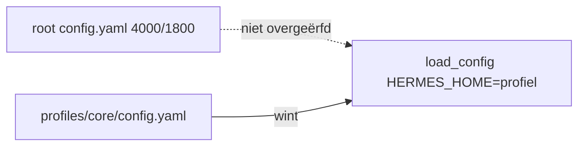

# Memory-architectuur (Windows fork)

Operationele samenvatting; vault-details staan in `Documents/Hermes Knowledge/README.md`.

## Aanbevolen stack

- **L1** — `MEMORY.md` / `USER.md` per profiel (trust limits 4000/1800)
- **L2** — FTS5 `state.db` (`session_search`)
- **L3** — **uit** op productie-profielen (geen Honcho/Mem0)
- **L4** — Obsidian vault = `Hermes Knowledge` (`OBSIDIAN_VAULT_PATH`)
- **RAG** — LanceDB per domein voor bronnen
- **SOUL** — gedrag per profiel

## Env (canoniek)

Bron van waarheid: `%USERPROFILE%\.hermes\.env` (voorbeeldregels: [templates/MEMORY_ENV_VAULT.example](templates/MEMORY_ENV_VAULT.example)). Daarna sync naar runtime:

```bat
windows\SYNC_HERMES_API_ENV.bat
```

Zet `OBSIDIAN_VAULT_PATH`, `WIKI_PATH` en `KNOWLEDGE_BASE_PATH` op alle profielen (`%LOCALAPPDATA%\hermes\profiles\*\`.env`). Zonder sync vallen profielen zoals `ict` terug op de lege default `Documents/Obsidian Vault`.

```env
OBSIDIAN_VAULT_PATH="C:/Users/jamel/Documents/Hermes Knowledge"
WIKI_PATH="C:/Users/jamel/Documents/Hermes Knowledge"
KNOWLEDGE_BASE_PATH="C:/Users/jamel/Documents/Hermes Knowledge"
```

Na wijziging in `~/.hermes\.env`: sync uitvoeren; Hermes TUI start daarna automatisch een nieuwe sessie (zie `/new` hieronder).

**Automatisch:** `UPDATE_HERMES.bat`, `POST_GIT_PULL.bat` en `SYNC_TRUST_RUNTIME.bat` roepen `sync_hermes_api_env.ps1` aan (inclusief idempotente vault-scaffold uit `docs/templates/obsidian_vault_scaffold/`).

**Obsidian openen:** `windows\OPEN_OBSIDIAN_VAULT.bat` — env-sync, scaffold, start Obsidian op `OBSIDIAN_VAULT_PATH`. Eerste keer in Obsidian: *Open map als kluis* als het welkomstscherm verschijnt. Taakbalk: `Hermes - Obsidian vault - naar taakbalk slepen.lnk` (na `REFRESH_TASKBAR_SHORTCUTS.bat` of `FIX_TASKBAR_ICONS.bat`).

**E2E audit (16 stappen + productie-poort):**

```bat
windows\audits\RUN_MEMORY_ARCHITECTURE_E2E.bat
windows\audits\RUN_MEMORY_PRODUCTION_GATE.bat
windows\audits\VALIDATE_AUDIT_PS1_SYNTAX.bat
```

| Bestand | Rol |
|---------|-----|
| `RUN_MEMORY_ARCHITECTURE_E2E.bat` / `.ps1` | Entry; `.ps1` is dunne launcher (geen dot-source — stabiel in Cursor/PSES) |
| `MemoryArchitectureE2E.core.ps1` | Implementatie: 16 stappen, dot-source `MemoryAuditCommon.ps1` |
| `RUN_MEMORY_PRODUCTION_GATE.ps1` | Limits + memory E2E + trust E2E + 55 pytest |

**IDE:** rode strepen op audit-`.ps1` → `VALIDATE_AUDIT_PS1_SYNTAX.bat`, daarna PowerShell-sessie herstarten en venster reloaden. Zie `windows\audits\README.md`.

| Stap | Controle |
|------|----------|
| 1/16 | Repo: upstream, `POST_GIT_PULL`, `SYNC_TRUST_RUNTIME` + dedup + post-sync |
| 2–7 | Vault-env sync, profiel-.env, vault-structuur, geen L3, KANBAN + core MEMORY |
| 8–10 | Obsidian skill, config-limits 4000/1800 (root + 13 profielen) |
| 11–13 | core MEMORY-grootte, UTF-8 §-encoding |
| 14/16 | **Alle profielen:** MEMORY/USER binnen limiet, geen dubbele §, geen mojibake-regel |
| 15/16 | Repo: `deduplicate_memories.py`, `Invoke-MemoryTrustPostSync`, notice-module |
| 16/16 | TUI auto `/new`: `newChatNotice.ts`, `useInstitutionalNewChatAutoReset`, `gateway.ready` |

## Productie-checklist (automatisch via `SYNC_TRUST_RUNTIME.bat`)

| Stap | Actie | Succes |
|------|--------|--------|
| 1–3 | `SYNC_TRUST_RUNTIME.bat` | SOUL + memory-seed + dedup + limits + vault-env + snapshot |
| 4 | (zelfde BAT) `audit_profile_memories.ps1` | geen OVER, geen `§`, geen identiteitslek |
| 5 | (zelfde BAT) `RUN_MEMORY_PRODUCTION_GATE` | PASS (tenzij `HERMES_SKIP_MEMORY_PRODUCTION_GATE=1`; 55 pytest) |
| 6 | (zelfde BAT) `/new`-reminder JSON | TUI: auto `/new` bij start + live tijdens sync; CLI: gele banner |

Handmatig alleen bij incident: `audit_profile_memories.ps1 -FixEncoding`, of `python scripts\deduplicate_memories.py` zonder volledige trust-sync. Dedup verwijdert ook **preamble-duplicaten** vóór de eerste `§` en losse mojibake-regels (`Â`).

### Nieuwe sessie na sync (`/new`)

| Client | Gedrag |
|--------|--------|
| **TUI** | Bij `gateway.ready`: pending notice → automatisch `newSession`; tijdens open TUI: `fs.watch` op `institutional_new_chat_required.json` |
| **Klassieke CLI** | Gele banner via `format_new_chat_notice_rich()`; handmatig `/new` wist vlag |
| **Beide** | `acknowledge_new_chat_notice()` na succesvolle `/new` |

Runtime-vlag: `%LOCALAPPDATA%\hermes\institutional_new_chat_required.json` (geschreven door `Set-InstitutionalNewChatReminder` in post-sync).

### Profiel-lek (waarom elk profiel eigen `memory:` nodig heeft)



`profile_model_inheritance` past alleen `model` toe; zonder profiel-blok valt runtime terug op default **2200/1375**.

### Frozen snapshot

Memory wordt bij sessiestart ingefrozen. Na sync van config, SOUL of MEMORY/USER: **nieuwe sessie** verplicht — TUI doet dit automatisch na trust-sync; klassieke CLI: `/new` of banner volgen.

### Gedeelde audit-modules

| Module | Pad |
|--------|-----|
| E2E + gate helpers | `windows\scripts\MemoryAuditCommon.ps1` |
| Profiel-rapport | `windows\scripts\audit_profile_memories.ps1` |
| §-deduplicatie (runtime) | `scripts\deduplicate_memories.py` (`deduplicate_content`) |
| Post-sync keten | `windows\scripts\Invoke-MemoryTrustPostSync.ps1` |
| `/new`-reminder | `hermes_cli\institutional_new_chat_notice.py` |
| TUI auto `/new` | `ui-tui\src\lib\newChatNotice.ts`, `useInstitutionalNewChatAutoReset.ts` |
| Manifest / backup-paden | `windows\HermesAuditBundleFiles.ps1`, `windows\HermesCriticalWindowsRepoPaths.ps1` |
| Obsidian vault (L4) | `windows\OPEN_OBSIDIAN_VAULT.bat`, `scripts\open_obsidian_vault.ps1`, `scripts\ensure_hermes_knowledge_vault.ps1` |

## Gerelateerd

- [TRUST_FORENSIC_PROTOCOL.md](TRUST_FORENSIC_PROTOCOL.md)
- `%LOCALAPPDATA%\hermes\profiles\core\KANBAN_WORKFLOWS.md` — sectie *Geheugen (L1–L4)*
