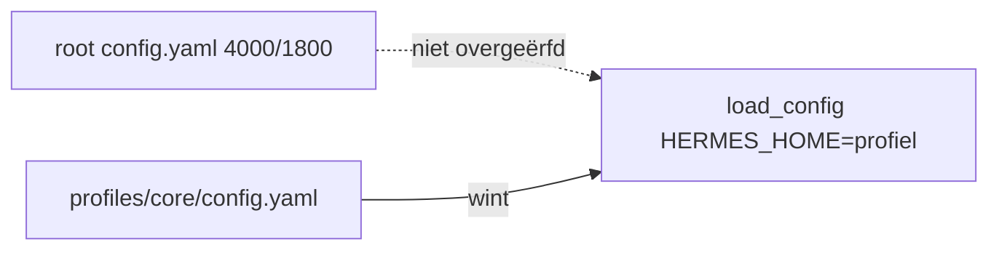

# Memory-architectuur (Windows fork)

Operationele samenvatting; vault-details staan in `Documents/Hermes Knowledge/README.md`.

## Aanbevolen stack

- **L1** — `MEMORY.md` / `USER.md` per profiel (trust limits 4000/1800)
- **L2** — FTS5 `state.db` (`session_search`)
- **L3** — **uit** op productie-profielen (geen Honcho/Mem0)
- **L4** — Obsidian vault = `Hermes Knowledge` (`OBSIDIAN_VAULT_PATH`)
- **RAG** — LanceDB per domein voor bronnen
- **SOUL** — gedrag per profiel

## Env (canoniek)

Bron van waarheid: `%USERPROFILE%\.hermes\.env` (voorbeeldregels: [templates/MEMORY_ENV_VAULT.example](templates/MEMORY_ENV_VAULT.example)). Daarna sync naar runtime:

```bat
windows\SYNC_HERMES_API_ENV.bat
```

Zet `OBSIDIAN_VAULT_PATH`, `WIKI_PATH` en `KNOWLEDGE_BASE_PATH` op alle profielen (`%LOCALAPPDATA%\hermes\profiles\*\`.env`). Zonder sync vallen profielen zoals `ict` terug op de lege default `Documents/Obsidian Vault`.

```env
OBSIDIAN_VAULT_PATH="C:/Users/jamel/Documents/Hermes Knowledge"
WIKI_PATH="C:/Users/jamel/Documents/Hermes Knowledge"
KNOWLEDGE_BASE_PATH="C:/Users/jamel/Documents/Hermes Knowledge"
```

Na wijziging in `~/.hermes\.env`: sync uitvoeren, dan nieuwe Hermes-sessie (`/new`).

**Automatisch:** `UPDATE_HERMES.bat`, `POST_GIT_PULL.bat` en `SYNC_TRUST_RUNTIME.bat` roepen `sync_hermes_api_env.ps1` aan.

**E2E audit:**

```bat
windows\audits\RUN_MEMORY_ARCHITECTURE_E2E.bat
windows\audits\RUN_MEMORY_PRODUCTION_GATE.bat
```

## Productie-checklist

| Stap | Actie | Succes |
|------|--------|--------|
| 1 | `apply_trust_memory_limits.ps1` | `[OK]` root + 13 profielen |
| 2 | `SYNC_HERMES_API_ENV.bat` | vault-paden op alle `.env` |
| 3 | `scripts\audit_profile_memories.ps1` | geen OVER, geen `§`, geen identiteitslek |
| 4 | `audits\RUN_MEMORY_PRODUCTION_GATE.bat` | PASS |
| 5 | Hermes **`/new`** | nieuwe sessie laadt config + memory-snapshot |

### Profiel-lek (waarom elk profiel eigen `memory:` nodig heeft)



`profile_model_inheritance` past alleen `model` toe; zonder profiel-blok valt runtime terug op default **2200/1375**.

### Frozen snapshot

Memory wordt bij sessiestart ingefroren. Na sync van config, SOUL of MEMORY/USER: altijd **`/new`** — anders draait de agent op oude limieten of oude L1-tekst.

### Gedeelde audit-modules

| Module | Pad |
|--------|-----|
| E2E + gate helpers | `windows\scripts\MemoryAuditCommon.ps1` |
| Profiel-rapport | `windows\scripts\audit_profile_memories.ps1` |
| Manifest / backup-paden | `windows\HermesAuditBundleFiles.ps1`, `windows\HermesCriticalWindowsRepoPaths.ps1` |

## Gerelateerd

- [TRUST_FORENSIC_PROTOCOL.md](TRUST_FORENSIC_PROTOCOL.md)
- `%LOCALAPPDATA%\hermes\profiles\core\KANBAN_WORKFLOWS.md` — sectie *Geheugen (L1–L4)*
