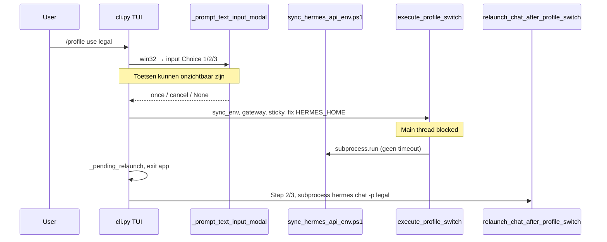

# Audit: profielwissel op Windows (NL fork)

**Datum:** 2026-05-30  
**Scope:** `/profile use` in chat, `hermes profile use`, `SWITCH_PROFILE*.bat`, relaunch, upstream-docs vs fork-gedrag.  
**Symptoom (productie):** Na `/profile use legal` blijft prompt `core >`, typen toont niets in de composer, sessie lijkt minutenlang vast.

---

## Samenvatting

| # | Bevinding | Ernst |
|---|-----------|-------|
| 1 | **Verborgen stdin-bevestiging** op Win32 (`Choice [1/2/3]:`) — toetsen verschijnen niet in TUI | **Kritiek** |
| 2 | **`sync_hermes_api_env.ps1` zonder timeout** — kan TUI minutenlang bevriezen | **Hoog** |
| 3 | **`execute_profile_switch` op main thread** — blokkeert prompt_toolkit tijdens sync/gateway | **Hoog** |
| 4 | **Upstream documentatie vs fork** — paden `~/.hermes`, geen in-chat relaunch op Windows | **Medium** |
| 5 | **FAQ “Does it work on Windows?”** vs [Windows Native Guide](https://hermes-agent.nousresearch.com/docs/user-guide/windows-native) | **Medium** (doc) |
| 6 | **E2E test geen echte TUI** — `HERMES_PROFILE_E2E` subprocess only | **Medium** (test gap) |
| 7 | **Statusbalk ⚙ N** — achtergrond-shells, geen profielvoortgang | **Laag** (UX verwarring) |

**Status 2026-05-30 (geïmplementeerd):**

- `/profile` en NL-intent: **niet** synchroon in `handle_enter` — `process_command` op **achtergrondthread** (`_schedule_profile_command_async`) zodat de TUI-modal niet de event-loop blokkeert
- Bevestiging: **TUI-modal** in de composer (`1`/`2` of ↑/↓ + Enter); geen dubbele stdin-box onder prompt_toolkit
- Zware stappen (sync/gateway/relaunch) **na** TUI-exit (`_pending_relaunch`)
- `sync_hermes_api_env.ps1`: **timeout** + fout in `ProfileSwitchResult`
- `execute_profile_switch_bounded` in exit-handler na bevestiging
- **Relaunch:** geen stderr-spinner tijdens `chat` (anders prompt `⟳ Opstarten` i.p.v. `legal ❯`) — `hermes_cli/relaunch.py`

**Fallback zonder TUI:** `windows\SWITCH_PROFILE_AND_CHAT.bat <naam>`.

**Verificatie:** `windows\audits\RUN_PROFILE_SWITCH_E2E.bat` + handmatig `/profile use legal` in WT.

Historische aanbevelingen: [§8 Aanbevelingen](#8-aanbevelingen).

---

## 1. Referentie: upstream documentatie

### [Windows (Native) — Early Beta](https://hermes-agent.nousresearch.com/docs/user-guide/windows-native)

- Native pad: `%LOCALAPPDATA%\hermes`, installer, Git Bash voor terminal tool, prompt_toolkit-TUI als ondersteund.
- **Geen** aparte sectie over `/profile use` of in-chat profielwissel met herstart.
- Waarschuwt voor “rough edges” rond subprocess, paden, console — relevant voor profielwissel (PowerShell-child, relaunch).

### [Profiles (user guide)](https://hermes-agent.nousresearch.com/docs/user-guide/profiles)

- `hermes profile use <name>` = sticky default; prompt wordt `coder ❯`.
- **Verwachting:** na `profile use` volstaat `hermes chat` — **geen** verplichte TUI-relaunch in upstream-doc.
- Paden overal `~/.hermes` / `~/.local/bin` — op Windows fork: `%LOCALAPPDATA%\hermes` + conda/`hermes_cli.main`.

### [FAQ — Profiles](https://hermes-agent.nousresearch.com/docs/reference/faq#profiles)

- Beantwoordt beheer (tokens, isolatie, export) — **niet** in-chat switch op Windows.
- FAQ-body zegt nog “**Not natively**” onder Windows (WSL2-only); dat botst met de Windows Native-pagina (early beta). Gebruikers kunnen denken dat profielen op native Windows niet bestaan.

### Fork-documentatie (canoniek voor deze installatie)

| Doc | Inhoud |
|-----|--------|
| `docs/PROFILE_SWITCH.md` | 3-stappen flow, `--fix-hermes-home`, sync, gateway |
| `windows/TERMINAL_WINDOWS.md` | Primair `/profile use` in WT; fallback `SWITCH_PROFILE.bat` |
| `docs/HERMES_HOME_WINDOWS.md` | Root `HERMES_HOME`, niet `profiles\*` |

---

## 2. Architectuur fork (wat er gebeurt bij `/profile use legal`)



| Stap | Module | Windows-specifiek |
|------|--------|-------------------|
| Bevestiging | `cli.py` `_handle_profile_command` → `_prompt_text_input_modal` | `sys.platform == "win32"` → `_prompt_text_input("Choice [1/2/3]: ")` i.p.v. TUI-modal (#30768) |
| Orchestratie | `hermes_cli/profile_switch.py` `execute_profile_switch` | Default `sync_env=True` → PowerShell |
| Gateway | `profiles._stop_gateway_process` | Max ~10 s wacht op PID |
| Relaunch | `hermes_cli/relaunch.py` | `subprocess.run` + spinner; **geen** exec op Windows |

---

## 3. Root causes ( gekoppeld aan gebruikerssymptomen )

### 3.1 Kritiek — Onzichtbare bevestiging, typen doet “niets”

**Code:** `cli.py` regels ~7692–7698: op Win32 altijd stdin-fallback voor profiel-modal.

**Mechanisme:**

1. `run_in_terminal(_ask)` roept `input("Choice [1/2/3]: ")` aan terwijl prompt_toolkit de composer nog tekent als `core >`.
2. Gebruiker typt → bytes gaan naar **stdin**, niet naar de zichtbare buffer → **lege composer**.
3. Geen timeout op deze Win32-tak (non-Win32 modal heeft 120 s).
4. Label `Choice [1/2/3]` terwijl profielwissel maar **2** keuzes heeft (`once`, `cancel`) — extra verwarring.

**Past bij:** prompt blijft `core >`, 10+ minuten “vast”, statusbalk ongewijzigd (92.8K/256K, 36%, ⚙ 2).

### 3.2 Hoog — API-sync hangt zonder timeout

**Code:** `profile_switch.py` `sync_profile_env_windows()`:

```python
subprocess.run(["powershell", ..., "-File", str(script)], check=False)
```

Geen `timeout=`. Script kan lang duren (`collect_env_sync_keys.py`, `ensure_hermes_knowledge_vault.ps1`, vele profiel-`.env`).

**Mechanisme:** `process_command` / `_handle_profile_command` draait op de **main thread** → volledige TUI-freeze tot PowerShell klaar is.

### 3.3 Hoog — Zware work vóór relaunch op UI-thread

Volgorde na bevestiging:

1. `execute_profile_switch` (sync + gateway + kanban reclaim)
2. Pas daarna `_pending_relaunch` en `app.exit()`
3. Dan `relaunch_chat_after_profile_switch`

Gebruiker ziet geen “Stap 1/3” als de thread al geblokkeerd is vóór de eerste `_cprint`, of output scrollt buiten beeld.

### 3.4 Medium — Documentatie / verwachtingsmanagement

| Bron | Wat gebruiker leest | Wat fork doet |
|------|---------------------|---------------|
| Upstream profiles | `profile use` + `hermes chat` | In-chat: bevestiging + **automatische** chat-relaunch |
| Upstream FAQ | `~/.hermes/active_profile` | `%LOCALAPPDATA%\hermes\active_profile` |
| Statusbalk 36% | Lijkt “bezig” | Alleen **context %**, geen profielwissel |
| Statusbalk ⚙ 2 | Lijkt “2 taken wissel” | `process_registry.count_running()` — **bg shells** |

### 3.5 Medium — Upstream `hermes profile use` vs fork

**`hermes_cli/main.py`:** `execute_profile_switch` alleen als `--fix-hermes-home` / `--no-sync-env` / `--no-restart-gateway` gezet; anders alleen `set_active_profile()`.

**Fork batch:** `SWITCH_PROFILE.bat` roept altijd `profile use %1 --fix-hermes-home` aan — **wel** volledige orchestratie, maar **zonder** TUI en zonder in-chat stdin-trap.

### 3.6 Laag — Gateway / kanban

- Gateway stop: bounded (~10 s) — onwaarschijnlijk 10 min.
- Kanban reclaim: bounded per worker — onwaarschijnlijk 10 min tenzij extreem veel workers.

### 3.7 Terminal overlay (bekend, parallel probleem)

`windows/MOUSE_OVERLAY_FIX.md`: onzichtbare conhost kan muistoetsen/titelbalk blokkeren. Kan **samengaan** met profielwissel (zelfde WT-sessie). Herstel: `RESET_TERMINAL.bat`, niet blind `/profile use` herhalen.

---

## 4. Wat upstream **niet** dekt (fork-gaps)

| Onderwerp | Upstream | Deze fork |
|-----------|----------|-----------|
| In-chat `/profile use` + relaunch | Niet gedocumenteerd op windows-native | `cli.py` + `PROFILE_SWITCH.md` |
| `HERMES_HOME` root vs `profiles\*` | Generiek `HERMES_HOME` | `normalize_user_hermes_home`, `--fix-hermes-home` |
| Windows API-sync bij switch | N.v.t. | `sync_hermes_api_env.ps1` |
| Win32 confirm UX | N.v.t. | Stdin-fallback (#30768) — **buggy UX** |
| Gateway handoff bij switch | Per profiel handmatig | Auto als gateway op oud profiel draaide |

---

## 5. Testdekking

| Test | Dekking | Gap |
|------|---------|-----|
| `tests/overlay/test_profile_switch.py` | `execute_profile_switch`, HERMES_HOME fix, sync hook | Geen echte PowerShell |
| `tests/overlay/test_profile_switch_e2e.py` | Subprocess `profile use` (env `HERMES_PROFILE_E2E=1`) | **Geen TUI**, geen `input()` |
| `tests/cli/test_institutional_profile_chat_ux.py` | Intent parser, prompt prefix, SOUL-tekst | Geen modal/win32 |
| `windows/audits/RUN_PROFILE_SWITCH_E2E.bat` | Batch + pytest | Geen “typ niets zichtbaar” scenario |

**Conclusie:** Productie-falen (onzichtbare stdin + lange sync) valt **buiten** de groene E2E-poort.

---

## 6. Diagnose-checklist (support)

```powershell
# 1. Sticky profiel
Get-Content "$env:LOCALAPPDATA\hermes\active_profile" -ErrorAction SilentlyContinue

# 2. User HERMES_HOME (moet root zijn)
[Environment]::GetEnvironmentVariable('HERMES_HOME','User')

# 3. Verify script
powershell -NoProfile -File hermes-agent\windows\scripts\verify_hermes_home.ps1
```

| Observatie | Interpretatie |
|------------|----------------|
| `active_profile` = `legal`, prompt nog `core >` | Oude sessie; relaunch mislukt → `SWITCH_PROFILE_AND_CHAT.bat legal` |
| `active_profile` = `core` | Switch nooit afgerond → batch of blind `1`+Enter in vast venster |
| Hangende `powershell` / `python` na switch | Sync of child chat → kill + RESET_TERMINAL |

---

## 7. Workarounds (productie)

1. **Primair:** `windows\SWITCH_PROFILE_AND_CHAT.bat legal` (of `legal chat` in nieuwe WT-tab).
2. **Alleen sticky:** `windows\SWITCH_PROFILE.bat legal` → daarna Hermes volledig afsluiten en opnieuw `start_hermes.bat`.
3. **In-chat zonder herstart:** `/profile use legal --no-restart` → handmatig nieuwe chat.
4. **Vast venster:** `Ctrl+C` → tab sluiten → `RESET_TERMINAL.bat` → niet opnieuw `/profile use` in dezelfde sessie.
5. **Blind in vast venster:** `1` + Enter (bevestiging), daarna max 30 s wachten op herstart.

---

## 8. Aanbevelingen

### P0 — Gebruikersblokkade

| # | Fix | Rationale |
|---|-----|-----------|
| P0.1 | Win32: **TUI-modal** voor profielbevestiging (zelfde panel als `/new`), of zichtbare full-screen prompt met keuzetekst | Voorkomt onzichtbare stdin |
| P0.2 | Toon expliciet: `1 = Wissel en herstart, 2 = Annuleren` (niet `Choice [1/2/3]`) | Minder verwarring |
| P0.3 | Documenteer in `TERMINAL_WINDOWS.md` + SOUL: **op Windows liever batch dan `/profile use` in chat** tot P0.1 live is | Onmiddellijk duidelijk |

### P1 — Hangs

| # | Fix | Rationale |
|---|-----|-----------|
| P1.1 | `subprocess.run(..., timeout=120)` op `sync_profile_env_windows` + duidelijke foutmelding | Geen 10+ min freeze |
| P1.2 | `execute_profile_switch` **off main thread** of vóór TUI-start in batch-pad; in chat: spinner + `_command_running` | UI blijft uitlegbaar |
| P1.3 | Win32 stdin-confirm: **timeout 60 s** + auto-cancel | Geen eeuwig wachten |

### P2 — Docs & tests

| # | Fix | Rationale |
|---|-----|-----------|
| P2.1 | Fork-sectie in `PROFILE_SWITCH.md`: “Windows in-chat known issues” + link naar dit audit | Single source |
| P2.2 | E2E: gemockte trage sync + assert TUI niet blocked (of integration met timeout) | Regressie |
| P2.3 | Optioneel upstream PR: windows-native “Profile switch” paragraaf met `%LOCALAPPDATA%` | Community |

---

## 9. Conclusie

Profielwissel **werkt institutioneel** via `profile_switch.py` + batch (`--fix-hermes-home`), maar **`/profile use` in de Windows-TUI** heeft een **UX-defect** (stdin-bevestiging onder prompt_toolkit) en een **betrouwbaarheidsrisico** (ongebounded sync op de UI-thread). Dat verklaart het gerapporteerde gedrag: `core >`, geen zichtbare invoer, geen `legal >`, lange wachttijd.

**Upstream** beschrijft profielen als `hermes profile use` + apart `chat`; de fork voegt automatische relaunch toe — dat is **niet** op windows-native gedocumenteerd en is op Win32 **riskanter** dan de batch-route.

---

## Zie ook

- [PROFILE_SWITCH.md](PROFILE_SWITCH.md)
- [HERMES_HOME_WINDOWS.md](HERMES_HOME_WINDOWS.md)
- [../windows/TERMINAL_WINDOWS.md](../windows/TERMINAL_WINDOWS.md)
- [../windows/MOUSE_OVERLAY_FIX.md](../windows/MOUSE_OVERLAY_FIX.md)
- Upstream: [Windows Native](https://hermes-agent.nousresearch.com/docs/user-guide/windows-native) · [Profiles](https://hermes-agent.nousresearch.com/docs/user-guide/profiles) · [FAQ Profiles](https://hermes-agent.nousresearch.com/docs/reference/faq#profiles)
