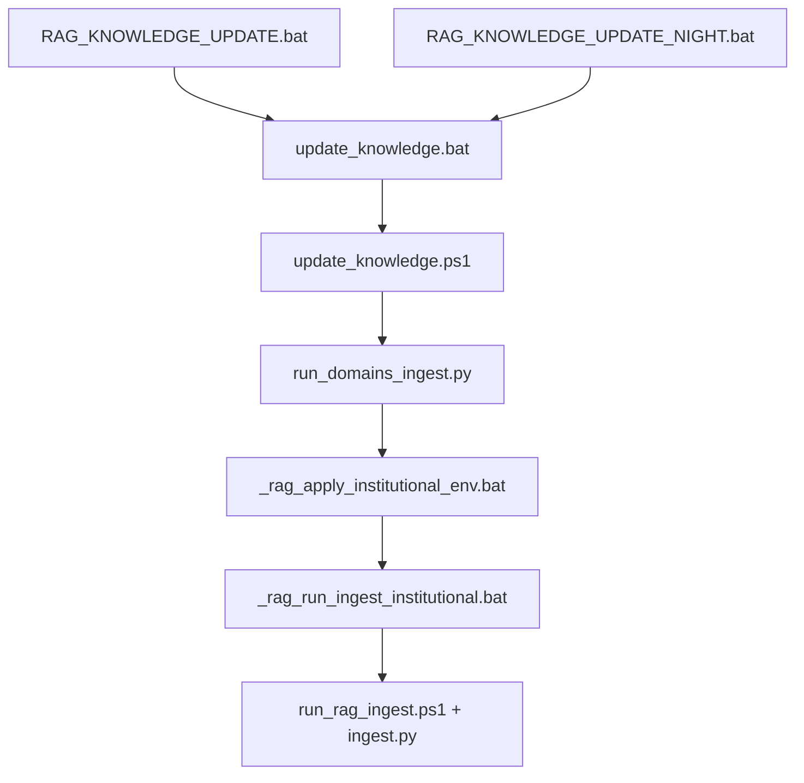

# RAG — institutionele omgevingsvariabelen

Deze waarden zijn **standaard** in alle officiële launchers. Je hoeft ze normaal **niet** handmatig te zetten.

Bron in code: `scripts/rag_pipeline/rag_institutional_defaults.py`  
Toepassing: `windows/scripts/rag/_rag_apply_institutional_env.bat`, `rag_institutional_env.ps1`, ingest-start in `run_domains_ingest.py`.

**Gerelateerd (geen RAG-env):** inference-model staat in `%LOCALAPPDATA%\hermes\config.yaml`, niet in profiel-yaml — zie `docs/PROFILE_MODEL_INHERITANCE.md` en `docs/README.md`.

## Aanbevolen defaults (future-proof)

| Variabele | Default | Wanneer wijzigen |
|-----------|---------|------------------|
| `HERMES_RAG_LIVE_STALE_SEC` | `120` | Alleen **verhogen** (bijv. `300`) als live status ten onrechte als “verouderd” wordt gemeld terwijl ingest nog loopt op extreem trage PDF’s. **Niet verlagen** — te kort geeft valse “stale” meldingen. |
| `HERMES_RAG_QUIET_TORCH` | `1` | Zet `0` alleen bij **debug** van PyTorch/embed. Geen invloed op indexkwaliteit. |
| `HERMES_RAG_PERF_PROFILE` | `safe` | `balanced` / `fast` alleen op een machine met veel RAM/CPU en na test op één domein. |
| `HERMES_NONINTERACTIVE` | `1` (alleen nacht) | Alleen in `RAG_KNOWLEDGE_UPDATE_NIGHT.bat` — geen J/N-prompt. Taakbalk/handmatig: `RAG_KNOWLEDGE_UPDATE.bat` wist deze var → J/N-keuze. |
| `HERMES_RAG_FRESH` | `n` (nacht) | `j` alleen als je database **bewust** wilt wissen. |

Gerelateerd (geen env, wel gedrag):

| Mechanisme | Doel |
|------------|------|
| `rag_ingest_live_status.json` + `run_state` | Geen misleidende `40/40` na afloop; `completed` / `failed` |
| `ingest_live_status.py --reconcile` | Oude live_status syncen met eindrapport |
| `check_ingest_status.bat` | Status + auto-reconcile per domein |

## Waar het wordt gezet



## Handmatig overschrijven (zeldzaam)

```bat
set HERMES_RAG_LIVE_STALE_SEC=300
set HERMES_RAG_QUIET_TORCH=0
windows\scripts\update_knowledge.bat legal
```

## PyTorch `W0521` / KernelPreference (cosmetisch)

Bij `--mcp-test` of ingest kan één regel op stderr verschijnen:

`W0521 ... KernelPreference ... register_constant() on Enum ... deprecated`

- **Geen Hermes-fout** — waarschuwing uit `torch` bij laden van sentence-transformers.
- **MCP blijft OK** als je `[OK] MCP lancedb-...` ziet.
- **Oplossing niet nodig** voor productie; standaard `HERMES_RAG_QUIET_TORCH=1` dempt veel ruis bij ingest.
- Later: torch/sentence-transformers updaten wanneer upstream het oplost.

## Dependency-pinning na `UPDATE_HERMES` (bewust)

| Fase | Package | Versie |
|------|---------|--------|
| `hermes update` (uv) | `youtube-transcript-api` | **1.2.4** (pyproject `[all]`) |
| Post-merge `install_rag_extras.ps1` | `markitdown[all]==0.1.5` | trekt `youtube-transcript-api` **~1.0.3** |

Dit is **geen regressie**: `markitdown[all]` pin op 1.0.x. RAG-ingest via YouTube gebruikt die oudere pin; Office/PDF blijft via markitdown. Geen actie tenzij je bewust alles op 1.2.x wilt (conflict met markitdown — zie comment in `pyproject.toml`).

## Zie ook

- `docs/RAG_TWEE_FASEN.md` — twee fasen index vs. chat
- `docs/PROFILE_SOUL.md` — persona per profiel
- `scripts/rag_pipeline/ACTIVATION.md` — technische pipeline
