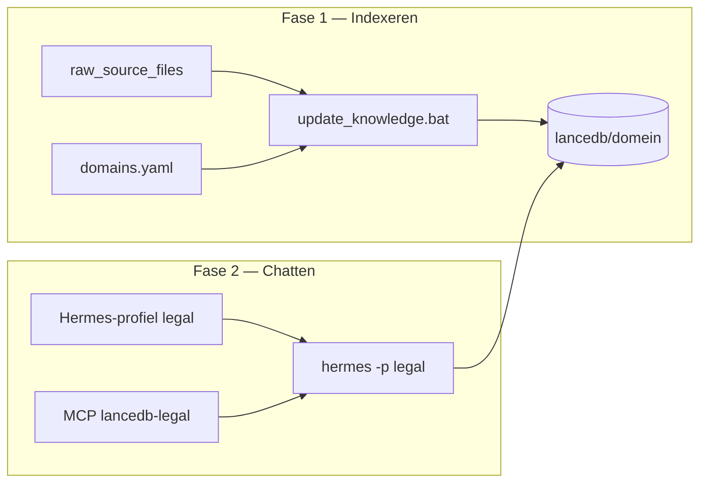

# RAG voor beginners — twee programma’s, twee fasen

Hermes kennis ophalen werkt als een **bibliotheek** plus een **balie-medewerker**. Beide zijn nodig; ze doen niet hetzelfde.

## Analogie

| Rol | Wat het is | Waar het staat |
|-----|------------|----------------|
| **Bibliotheek** | Alle bronnen omzetten naar doorzoekbare stukken (embeddings) in LanceDB | Fase 1: ingest |
| **Balie-medewerker** | Hermes-profiel dat weet *welke* bibliotheek te doorzoeken via MCP | Fase 2: chat |

- **Zonder ingest** = lege bibliotheek → `search_knowledge` vindt niets.
- **Zonder profiel** (SOUL + `config.yaml` met juiste MCP) = agent weet niet welke LanceDB bij deze chat hoort.
- **Model/provider** hoort **niet** in het profiel-yaml — alleen in root `%LOCALAPPDATA%\hermes\config.yaml` (zie [PROFILE_MODEL_INHERITANCE.md](PROFILE_MODEL_INHERITANCE.md)).

## Twee fasen (niet tegelijk met Kanban op dezelfde DB)

**Belangrijk:** draai geen **ingest** en **Kanban-taken die dezelfde LanceDB** intensief gebruiken tegelijk. LanceDB kan dan locken of vastlopen. Volgorde: ingest klaar → rooktest → Kanban.

## Tabel: yaml = indexeren, profiel = chatten

| | `domains.yaml` | Hermes-profiel (`%LOCALAPPDATA%\hermes\profiles\<naam>\`) |
|--|----------------|--------------------------------------------------------|
| **Doel** | Waar bronnen staan, waar index komt, ingest-opties | Wie de agent is, welke MCP-tools actief zijn |
| **Model** | — (niet van toepassing) | **Overerft** van root config (geen `model:` hier) |
| **Pad bronnen** | `source_dir` → `~/data/raw_source_files/...` | — |
| **Pad index** | `lancedb_path` → `~/data/lancedb/<domein>` | `HERMES_LANCEDB_PATH` in profiel (zelfde pad) |
| **MCP-server** | `mcp_name: lancedb-legal` | Zelfde naam in `config.yaml` |
| **Starten** | `update_knowledge.bat legal` | `hermes -p legal` |

## Waarom niet één bestand?

- **domains.yaml** = batch-job: duizenden bestanden, timeouts, Whisper, embed-batch, quarantaine. “Koude” infrastructuur.
- **Profiel** = sessie: temperatuur, SOUL, welke tools. “Warme” chat.

Één bestand zou ingest-parameters in elke chat laden en omgekeerd.

## Koppeltabel (legal voorbeeld)

| Concept | domains.yaml | Omgevingsvariabele | Hermes-profiel |
|---------|--------------|-------------------|----------------|
| Domeinnaam | `name: legal` | — | mapnaam `legal` |
| Indexmap | `lancedb_path: ~/data/lancedb/legal` | `HERMES_LANCEDB_PATH` (tijdens ingest) |zelfde pad in profiel-config |
| MCP | `mcp_name: lancedb-legal` | — | `lancedb-legal` in MCP-lijst |
| Bronnen | `source_dir: 04_Legal_Corporate` | — | — |

Drie namen, **één fysieke map** voor de index.

## Rapportbestanden na ingest

| Bestand | Wanneer | Wat je ziet |
|---------|---------|-------------|
| `rag_ingest_run_summary.json` | Na elke run | Totaal geïndexeerd, skips, `all_sources_indexed` |
| `rag_ingest_live_status.json` | Tijdens run + na afloop | `run_state`: running/completed/failed; PID; na ingest altijd `completed` |
| `rag_ingest_skipped_report.md` | Bij skips | Welke bestanden en waarom |

Pad: `%USERPROFILE%\data\lancedb\<domein>\`

Snel controleren: `%USERPROFILE%\data\scripts\check_ingest_status.bat legal`

## Waar beginnen?

1. **Documentatie-index:** `docs/README.md`
2. **Structuur begrijpen:** `docs/domains.yaml.example`
3. **Model (eenmalig, alle profielen):** `hermes model` → root config
4. **Index draaien:** `windows\scripts\update_knowledge.bat --list` dan per domein of alles
5. **Chatten:** `hermes -p <profile_name>` en `search_knowledge` testen
6. **Dieper technisch:** `scripts/rag_pipeline/ACTIVATION.md`, `windows/README.md`

## Handmatig vs nacht-run

**Taakbalk / dubbelklik:** `windows\RAG_KNOWLEDGE_UPDATE.bat` (`.lnk` met `cmd /k`):

- J/N-prompt: typ `J` of `N` + Enter (default N)
- Venster blijft open tot **Press any key**

**Alleen geplande nacht-run:** `windows\RAG_KNOWLEDGE_UPDATE_NIGHT.bat`:

- `HERMES_NONINTERACTIVE=1` — geen J/N-prompt
- `HERMES_RAG_FRESH=n` — incrementeel

**Institutionele env:** zie `docs/RAG_INSTITUTIONAL_ENV.md` (`HERMES_RAG_LIVE_STALE_SEC=120`, `HERMES_RAG_QUIET_TORCH=1` — automatisch in launchers).

## Status legal (2026-05-21)

- Ingest **klaar**: 1665 bronnen, 0 skips
- Open: rooktest chat, Kanban legal, daarna 8 overige domeinen + `--mcp-test`

Zie `memory-bank/progress.md` voor actuele checklist.
