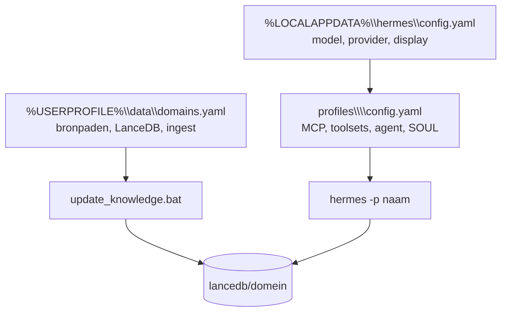

# Documentatie — Hermes-agent (J. fork, Windows NL)

Centrale index. Begin hier als je RAG, profielen of configuratie wilt begrijpen.

## Snel kiezen

| Ik wil… | Document |
|--------|----------|
| Begrijpen: index vs. chat (twee fasen) | [RAG_TWEE_FASEN.md](RAG_TWEE_FASEN.md) |
| Trust & Forensic (SOUL, memory, J.) | [TRUST_FORENSIC_PROTOCOL.md](TRUST_FORENSIC_PROTOCOL.md) — dagelijks: `windows/SYNC_TRUST_RUNTIME.bat` |
| Toolsets per domein (minimaal + opt-in) | [DOMAIN_TOOLSET_AUDIT.md](DOMAIN_TOOLSET_AUDIT.md) — sync: `windows/SYNC_DOMAIN_TOOLSETS.bat` |
| Model/provider voor **alle** profielen instellen | [PROFILE_MODEL_INHERITANCE.md](PROFILE_MODEL_INHERITANCE.md) |
| Profiel wisselen (chat, CLI, audit) | [PROFILE_SWITCH.md](PROFILE_SWITCH.md) |
| SOUL.md per domeinprofiel (waar, bewerken) | [PROFILE_SOUL.md](PROFILE_SOUL.md) |
| SOUL anatomy (10 secties, sync, migratie) | [SOUL_ANATOMY_SPEC.md](SOUL_ANATOMY_SPEC.md) |
| ICT domein (infra, devops, support, sysadmin) | `docs/09_ICT/`, `docs/templates/SOUL_ICT_DOMAIN.md` |
| Security domein (pentest, compliance, incident, forensics) | `docs/10_Security/`, `docs/templates/SOUL_SECURITY_DOMAIN.md` |
| Development domein (backend, frontend, architecture, quality) | `docs/11_Development/`, `docs/templates/SOUL_DEV_DOMAIN.md` |
| Data domein (database, analytics, pipeline, governance) | `docs/12_Data/`, `docs/templates/SOUL_DATA_DOMAIN.md` |
| Orchestrator routing (core) | [ORCHESTRATOR_ROUTING.md](ORCHESTRATOR_ROUTING.md) |
| Legal domein (lenzen, één bucket) | [LEGAL_DOMAIN_ARCHITECTURE.md](LEGAL_DOMAIN_ARCHITECTURE.md), [LEGAL_TAXONOMY.md](LEGAL_TAXONOMY.md), [LEGAL_ROLLOUT_CHECKLIST.md](LEGAL_ROLLOUT_CHECKLIST.md) |
| Landkaart / volledige lijsten | skill `landkaart` (`/landkaart`) |
| Domeinen toevoegen (`domains.yaml`) | [domains.yaml.example](domains.yaml.example) + [DOMAIN_BLUEPRINT.md](DOMAIN_BLUEPRINT.md) |
| RAG env-defaults (stale, torch-ruis) | [RAG_INSTITUTIONAL_ENV.md](RAG_INSTITUTIONAL_ENV.md) |
| Technische ingest/MCP-stappen | [../scripts/rag_pipeline/ACTIVATION.md](../scripts/rag_pipeline/ACTIVATION.md) |
| Windows-scripts en taakbalk | [../windows/README.md](../windows/README.md) |
| Terminal, skin, markdown-kleuren, API-home | [../windows/TERMINAL_WINDOWS.md](../windows/TERMINAL_WINDOWS.md) |
| User-data docs (STATUS/RECOVERY sync) | [USER_DATA_OPERATIONS.md](USER_DATA_OPERATIONS.md) |
| Backup & restore (schema v3, runtime) | [USER_DATA_OPERATIONS.md](USER_DATA_OPERATIONS.md) § Windows; `windows/INSTITUTIONAL.md` § Backup |
| IDE PSScriptAnalyzer (VS Code/Cursor) | [IDE_VSCODE_SETTINGS.example.json](IDE_VSCODE_SETTINGS.example.json) |
| Hermes starten zonder conda in PATH | [HERMES_START.md](HERMES_START.md) (kopie ook in workspace-root `HERMES_START.md`) |
| Blauwdruk: nieuw domein toevoegen | [DOMAIN_BLUEPRINT.md](DOMAIN_BLUEPRINT.md) |
| Presentatie / Rich renderer (10/10) | [INSTITUTIONAL_PRESENTATION.md](INSTITUTIONAL_PRESENTATION.md), porting [INSTITUTIONAL_PORTING_GUIDE.md](INSTITUTIONAL_PORTING_GUIDE.md), rooktest [templates/INSTITUTIONAL_RENDERER_TEST_PROMPT.md](templates/INSTITUTIONAL_RENDERER_TEST_PROMPT.md) |
| Voortgang / checklist | [../memory-bank/progress.md](../memory-bank/progress.md) |

## Configuratie — twee lagen

| Laag | Bestand | Bevat o.a. |
|------|---------|------------|
| **Root Hermes** | `%LOCALAPPDATA%\hermes\config.yaml` | `model`, `provider`, `display`, gateway |
| **Domeinprofiel** | `%LOCALAPPDATA%\hermes\profiles\<naam>\config.yaml` | `platform_toolsets.cli`, MCP `lancedb-<domein>`, **geen** `model:` |
| **Toolset-manifest** | `docs/domain_toolsets.yaml` | Sync: `windows/SYNC_DOMAIN_TOOLSETS.bat`; nieuw profiel: `--create-missing` |
| **RAG-batch** | `%USERPROFILE%\data\domains.yaml` | `source_dir`, `lancedb_path`, ingest-opties |

**Model wijzigen:** altijd `hermes model` of root `config.yaml` — nooit per profiel hardcoden (tenzij `model.inherit: false`). Zie [PROFILE_MODEL_INHERITANCE.md](PROFILE_MODEL_INHERITANCE.md).

## Paden (Windows)

| Concept | Pad |
|---------|-----|
| Hermes root | `%LOCALAPPDATA%\hermes\` (vaak `HERMES_HOME`; secrets: `.env` in root) |
| Legacy home | `%USERPROFILE%\.hermes\` — sync keys: `windows\SYNC_HERMES_API_ENV.bat` |
| Profiel `legal` | `%LOCALAPPDATA%\hermes\profiles\legal\` |
| SOUL legal | `%LOCALAPPDATA%\hermes\profiles\legal\SOUL.md` |
| RAG-config | `%USERPROFILE%\data\domains.yaml` |
| LanceDB legal | `%USERPROFILE%\data\lancedb\legal\` |
| Bronnen legal | `%USERPROFILE%\data\raw_source_files\04_Legal_Corporate\` |
| Repo (dev) | `D:\A.I\APPS\Hermes_agent_WS\hermes-agent\` |

## Onderhoud

- **Windows script-keten (handmatig):** `windows\VERIFY_WINDOWS_CHAIN.bat` — dubbelklik; controleert setup wrapper, `.bat`→`.ps1`, taakbalk-`.lnk` (eindigt met pause)
- **LanceDB onderhoud (list/inspect/compact/benchmark):** `windows\LANCEDB_MAINTENANCE.bat --list` / `--inspect` / `--init-missing` / `--compact` / `--benchmark` — zie `scripts/rag_pipeline/lancedb_maintenance.py` (geen ingest parallel; `--init-missing` = lege DB voor nieuw domein)
- **Skill/docs drift (fork):** `python scripts\audit_skill_drift.py` → `windows\audits\SKILL_DRIFT_AUDIT_*.md`
- **Na `git pull`:** `windows/POST_GIT_PULL.bat` (verify + trust + **SOUL anatomy 13 profielen** + domein-toolsets + taakbalk-iconen)
- **Nous upstream-update:** `windows\UPDATE_HERMES.bat` — preflight + merge + trust + toolsets + RAG + verify (zie [UPSTREAM_SYNC.md](../windows/UPSTREAM_SYNC.md))
- **Setup (dubbelklik):** `windows\SETUP_HERMES.bat` (standaard wizard); `OPEN_SETUP.bat` alleen wizard; `--files-only` zonder wizard
- **Taakbalk-iconen:** `python windows/tools/generate_colored_hermes_icons.py` → `windows\FIX_TASKBAR_ICONS.bat` → F5; pin via `.lnk`, niet `.bat`
- **Na upstream-merge:** inspectie via `git log` + rooktest-matrix in [UPSTREAM_SYNC.md § inspectie](../windows/UPSTREAM_SYNC.md#upstream-wijzigingen-na-merge-inspectie) (geen handmatig commit-archief in docs)
- **P0+P1-pipeline (institutioneel):** `windows\scripts\institutional_p0_p1.bat`  
  Sync MCP → doctor --fix → MCP-test alle domeinen → legal rooktest.  
  Opties: `--ingest-remaining` (7 domeinen; **lege bronmappen worden overgeslagen**), `--kanban` (na geslaagde rooktest).
- **Alleen MCP sync:** `python scripts\rag_pipeline\sync_profile_mcp_from_domains.py`
- **Verouderd `model:` in profielen:** `hermes doctor --fix`
- **Verouderd `mcp.servers`:** `hermes doctor --fix` of sync-script hierboven
- **Ingest-status:** `%USERPROFILE%\data\scripts\check_ingest_status.bat <domein>`
- **Doctor:** `hermes doctor` of `windows\DOCTOR_FIX.bat`
- **Profiel wisselen:** `windows\SWITCH_PROFILE.bat <naam>` of `/profile use <naam>` in chat; audit: `windows\audits\RUN_PROFILE_SWITCH_E2E.bat` — zie [PROFILE_SWITCH.md](PROFILE_SWITCH.md)
- **Backup (schema v3):** `windows\MANAGE_BACKUPS.bat` — Hermes **volledig stoppen**; `%LOCALAPPDATA%\hermes` → `runtime_hermes/` + persona-subset `localappdata_hermes/`; restore: `-RestoreRuntimeFull`, `-RestoreRuntimePersonas`, `-RestoreLegacyProfile` via `RESTORE_FROM_BACKUP.bat`; audit: `windows\audits\RUN_BACKUP_E2E.bat`
- **Kwaliteitspoort (periodiek):** `windows\audits\RUN_AUDITS.bat -IncludeProfileE2E` of `-IncludeInstitutionalE2E` / `-IncludeAllE2E` (incl. toolset E2E)
- **IDE-onderhoud E2E (volledige landkaart):** `windows\audits\RUN_IDE_MAINTENANCE_E2E.bat` of `-Full` (incl. institutioneel E2E); rapport in `windows\audits\IDE_MAINTENANCE_E2E_REPORT_*.md`
- **Domein-toolsets:** [DOMAIN_TOOLSET_AUDIT.md](DOMAIN_TOOLSET_AUDIT.md) — `SYNC_DOMAIN_TOOLSETS.bat` (`--create-missing` voor nieuw profiel); audit `RUN_TOOLSET_DOMAIN_E2E.bat`
- **Runtime provision (nieuw profiel):** `set HERMES_HOME=%LOCALAPPDATA%\hermes` → `windows\SYNC_DOMAIN_TOOLSETS.bat --create-missing` — zie [DOMAIN_BLUEPRINT.md](DOMAIN_BLUEPRINT.md) stap 9–10
- **SOUL sync + presentatie (10/10):** `windows\APPLY_INSTITUTIONAL_RUNTIME.bat` (display + SOUL + E2E); docs [INSTITUTIONAL_PRESENTATION.md](INSTITUTIONAL_PRESENTATION.md), porting [INSTITUTIONAL_PORTING_GUIDE.md](INSTITUTIONAL_PORTING_GUIDE.md); rooktest [templates/INSTITUTIONAL_RENDERER_TEST_PROMPT.md](templates/INSTITUTIONAL_RENDERER_TEST_PROMPT.md); verify: `python scripts/diagnose_renderer.py --verify`, `python scripts/score_institutional_render.py --verify`; guard vóór commit: `python scripts/verify_institutional_guard.py`; pariteit: `pytest tests/hermes_cli/test_normalizer_ts_parity.py`
- **SOUL anatomy (10 secties, 13 domeinprofielen):** [SOUL_ANATOMY_SPEC.md](SOUL_ANATOMY_SPEC.md) — bij start: `launch_soul_anatomy_deploy.ps1` (stamp); runtime: `windows\APPLY_SOUL_ANATOMY_RUNTIME.bat`; na pull: `windows\POST_GIT_PULL.bat`; validatie: `windows\audits\RUN_SOUL_ANATOMY_E2E.ps1`, `windows\audits\RUN_SOUL_DEPLOY_START_E2E.ps1`
- **Core SOUL referentie (repo):** `docs/templates/SOUL_CORE_ORCHESTRATOR.md` — runtime: `%LOCALAPPDATA%\hermes\profiles\core\SOUL.md`

## Memory bank (agent-context)

| Bestand | Inhoud |
|---------|--------|
| [../memory-bank/projectbrief.md](../memory-bank/projectbrief.md) | Scope en doelen |
| [../memory-bank/productContext.md](../memory-bank/productContext.md) | Waarom twee fasen + centraal model |
| [../memory-bank/systemPatterns.md](../memory-bank/systemPatterns.md) | Architectuurpatronen |
| [../memory-bank/techContext.md](../memory-bank/techContext.md) | Stack en paden |
| [../memory-bank/activeContext.md](../memory-bank/activeContext.md) | Huidige focus |
| [../memory-bank/progress.md](../memory-bank/progress.md) | Checklist en status |
