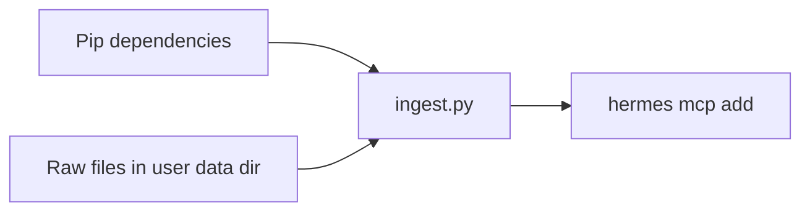

# LanceDB RAG-pijplijn activeren (handmatige terminalworkflow)

Dit document is de **in-repo** kopie van het activatieplan (Cursor-plan: *LanceDB RAG activeren*). Houd het hier bij voor versiebeheer; werk het bij wanneer de workflow wijzigt.

## Context

Scripts in deze map:

- `ingest.py` — indexeert bronnen naar LanceDB (tabel `knowledge_base`); standaard `~/data/raw_source_files` → `~/data/my_lancedb`, override met **`HERMES_RAG_RAW_SOURCE`** / **`HERMES_LANCEDB_PATH`**. Per bronbestand: **deterministische `id` per chunk** + **`merge_insert`** (upsert). Extensies en uitsluitingen: **`source_formats.py`** + **`ingest_config.py`**.
- `source_formats.py` — centrale extensiematrix (plain / MarkItDown / media).
- `ingest_config.py` — uitsluitingen (`node_modules`, `~$*`, binaries) en **`HERMES_RAG_MAX_FILE_MB`** (default 150).
- `audio_transcriber.py` — lokale audio/video via faster-whisper + ffmpeg.
- `mcp_server.py` — stdio MCP-server met tool `search_knowledge`.
- `kb_schema.py` — gedeeld `KnowledgeSchema` (velden **`id`**, `text`, `vector`, `source`), padconstanten en `list_all_table_names()` (LanceDB `list_tables()` API).

**Idempotente upsert:** elke chunk krijgt een vaste **`id`** = SHA-256 van `(<relatief pad als POSIX>\\0#<chunk-index>)`. Bij heringest overschrijft **`merge_insert(..., on='id')`** bestaande rijen met dezelfde id en voegt nieuwe toe. Daardoor is optie **N** in `update_knowledge.bat` normaal **zonder dubbele embeddings** voor dezelfde chunk. **Let op:** als een bron **inkrimpt** (minder chunks na herschrijving), kunnen **oudere chunk-indexen** voor dat pad als zogenaamde orphans in de tabel blijven staan; gebruik desgewenst eenmalig **J** / leegmaken, of een toekomstige opruimstrategie per bron.

**Schema-upgrade:** bestond `knowledge_base` al **zonder** kolom `id`, dan stopt `ingest.py` met een foutmelding — eenmalig database wissen (**J** / `HERMES_RAG_FRESH=1`) of map handmatig verwijderen, daarna opnieuw indexeren.

**Paden:** `~/data/...` wordt op Windows `%USERPROFILE%\data\...` (niet automatisch je repo-schijf). Optioneel (institutioneel): zet **`HERMES_RAG_RAW_SOURCE`** en **`HERMES_LANCEDB_PATH`** (absolute paden of `~` / `%VAR%`) — zelfde variabelen lezen `ingest.py` en `kb_schema.py`; `windows\scripts\update_knowledge.bat` zet `HERMES_LANCEDB_PATH` vóór `python` gelijk aan de map die bij **J** wordt gewist.

**MCP-server:** start zonder crash ook als de database nog leeg is: ontbreekt `knowledge_base`, dan wordt een **lege** tabel met `KnowledgeSchema` aangemaakt. Voor echte antwoorden moet je daarna alsnog `ingest.py` draaien.



## Workflowtip: smoke-test

1. Map: `~/data/raw_source_files` (bijv. op Windows `%USERPROFILE%\data\raw_source_files`).
2. Bestand `test.txt` met bijvoorbeeld: *VWO Elite is een geavanceerd platform gebouwd door Jamel. Het lanceert in 2026.*
3. Voer daarna de stappen hieronder uit.

## Bronbestanden: drie gouden regels

1. **Underscores i.p.v. spaties** in bestandsnamen (`wiskunde_b_…` i.p.v. `Wiskunde B …`) — minder verwarring bij citaten en paden in LLM-output.
2. **Korte, beschrijvende namen** — bijvoorbeeld `wiskunde_b_domein_c_differentiaalrekening.md` i.p.v. `samenvatting1.md`; de bestandsnaam (en pad) wordt als `source`-metadata in LanceDB opgeslagen en helpt vindbaarheid.
3. **Markdown waar mogelijk** — werk theorie bij voorkeur uit in `.md` met duidelijke `##` / `###` koppen; dat sluit aan op de semantische chunking. PDF, Word, PowerPoint, spreadsheets, `.msg` en HTML/XML worden via MarkItDown naar Markdown gezet; opgeschoonde bron-MD blijft ideaal voor maximale structuur.

## Ondersteunde bronbestanden (ingest)

Alles onder `~/data/raw_source_files` wordt per extensie gescand. **Autoritatieve lijst:** [`source_formats.py`](source_formats.py) (`PLAIN_SUFFIXES`, `MARKITDOWN_SUFFIXES`, `AUDIO_SUFFIXES`, `VIDEO_SUFFIXES`).

| Route | Extensies (samenvatting) |
|--------|---------------------------|
| **UTF-8 tekst** | `.txt`, `.md`, `.json`, `.jsonl`, `.log`, `.csv`, `.tsv`, `.yaml`, `.yml`, `.toml`, `.ini`, `.rst`, `.adoc`, ondertitels `.vtt`, `.srt`, `.sbv` |
| **MarkItDown → Markdown** | **Office:** `.docx`, `.doc`, `.docm`, `.dotx`, `.dotm`, `.rtf`, `.xlsx`, `.xls`, `.xlsm`, `.xlsb`, `.pptx`, `.ppt`, `.pptm`, `.ppsx`, `.pps`, `.msg`, `.eml` · **OpenDocument:** `.odt`, `.ods`, `.odp` · **Web/PDF:** `.pdf`, `.html`, `.htm`, `.xml`, `.rss`, `.atom` · **Overig:** `.epub`, `.ipynb`, `.zip` · **Beeld:** `.png`, `.jpg`, `.jpeg`, `.webp`, `.gif`, `.bmp`, `.tif`, `.tiff`, `.heic` |
| **Whisper + ffmpeg** | **Audio:** `.mp3`, `.m4a`, `.wav`, `.ogg`, `.flac`, `.aac`, `.wma`, `.aiff`, `.opus`, … · **Video:** `.mp4`, `.mov`, `.mkv`, `.webm`, `.avi`, `.wmv`, `.mpeg`, `.3gp`, … |

**Niet geïndexeerd (bewust):** binaries (`.exe`, `.dll`, …), databases (`.sqlite`, `.parquet`), archieven `.7z`/`.rar` (wel `.zip` via MarkItDown), Office-lock `~$*`, mappen `.git` / `node_modules` / `__pycache__`, bestanden groter dan **`HERMES_RAG_MAX_FILE_MB`** (default **150**; zet op `0` voor onbeperkt).

Voor **MarkItDown** is `pip install "markitdown[all]"` aanbevolen; voor scans/beelden optionele vision/OCR-deps. Bij conversiefouten: `[WARN]` en door naar het volgende bestand.

## Windows: snelkoppeling (taakbalk)

Na setup of na **`windows\REFRESH_TASKBAR_SHORTCUTS.bat`** staat in **`hermes-agent\windows\`** o.a. **`Hermes - RAG kennis bijwerken - naar taakbalk slepen.lnk`**. Die verwijst naar **`windows\scripts\update_knowledge.bat`** (conda `hermes-env` + `python scripts/rag_pipeline/ingest.py`). Sleep de `.lnk` naar de taakbalk voor één-klik herbouw van de LanceDB-index.

Het batchbestand vraagt eerst **J/N** (tenzij **`HERMES_RAG_FRESH`** gezet is: `1`/`true`/`yes`/`j` = wis, `0`/`n`/`no` = behoud — handig voor taakplanner/CI). **J** verwijdert de LanceDB-map (na rename-check op locks; zie script) — standaard **`%USERPROFILE%\data\my_lancedb`**, of **`HERMES_LANCEDB_PATH`**. **N** laat de map staan; **`ingest.py`** doet dan **upsert** op chunk-`id`, dus geen duplicate chunks voor dezelfde bron+index. Sluit processen die LanceDB openhouden (bijv. MCP `lancedb-knowledge`) voordat je **J** kiest, anders faalt het wissen met een duidelijke fouttekst.

**Conda (geen hardcoded gebruikerspad):** het script zoekt `activate.bat` via **`HERMES_ACTIVATE_BAT`** (volledig pad), **`HERMES_CONDA_ROOT`**, of gangbare locaties onder `%USERPROFILE%` en `%LOCALAPPDATA%`. Omgevingsnaam standaard **`hermes-env`**; override met **`HERMES_CONDA_ENV`**.

## Stappen (eigen terminal, vanuit `hermes-agent` repo-root)

1. **Conda:** activeer `hermes-env` (prompt toont `(hermes-env)`), of bijvoorbeeld  
   `"%USERPROFILE%\miniconda3\Scripts\activate.bat" hermes-env`  
   (of het pad dat bij jullie hoort / `HERMES_CONDA_ROOT` uit `update_knowledge.bat`-logica).

2. **Werkdirectory:** `cd` naar de root van deze repo (waar `scripts/` relatief klopt).

3. **Dependencies:**

   ```text
   pip install lancedb mcp sentence-transformers
   pip install "markitdown[all]"
   ```

   **Fail fast:** `ingest.py` importeert `markitdown` statisch bovenaan. Ontbreekt het pakket, faalt het script direct bij start — niet pas na een lange scan. Op Windows PowerShell zijn de **aanhalingstekens** rond `markitdown[all]` verplicht.

4. **Ingestie:**

   ```text
   python scripts/rag_pipeline/ingest.py
   ```

5. **Hermes MCP — correcte CLI-syntax** (`--command` = executable, `--args` = script + evt. meer args):

   ```text
   hermes mcp add lancedb-knowledge --command python --args scripts/rag_pipeline/mcp_server.py
   ```

   **Windows:** als `python` op het PATH **niet** dezelfde omgeving is als `hermes-env` (gebruikelijk fout: `ModuleNotFoundError: lancedb`), gebruik het **volledige pad** naar die interpreter, bijvoorbeeld:

   ```text
   hermes mcp add lancedb-knowledge --command %USERPROFILE%\miniconda3\envs\hermes-env\python.exe --args scripts/rag_pipeline/mcp_server.py
   ```

   Start Hermes bij voorkeur vanuit deze repo-root zodat relatieve `--args` kloppen.

6. **Verifiëren:**

   ```text
   hermes mcp list
   hermes mcp test lancedb-knowledge
   ```

   Start daarna een **nieuwe** Hermes-sessie om de tools te laden.

## Koppeling Hermes ↔ `search_knowledge` (waar het spaak loopt)

Als Hermes bij vragen over jouw lokale kennis toch **VWO.com / Google / curl** gebruikt in plaats van LanceDB, ligt dat meestal aan één van deze twee punten:

1. **Geen verse sessie na MCP-wijziging** — Hermes laadt de lijst met MCP-servers en hun tools **alleen bij het starten van een nieuwe sessie**. Een terminalpaneel dat blijft hangen, of Hermes zonder volledige herstart, kent `search_knowledge` dan nog niet.
2. **Te algemene prompt** — Bij zoiets als “Gebruik je knowledge base” kan het model **internet-zoektools** prefereren boven de MCP-tool. Voor een **onomstotelijke rooktest** moet je expliciet naar `search_knowledge` verwijzen.

### Oplossingsmatrix (split commandocentrum, o.a. `start_hermes_split.bat`)

1. **Sessie beëindigen** — In het Hermes-linkerpaneel: `/exit`, of het hele Windows Terminal-venster sluiten (geen “alleen tab sluiten” als je zeker wilt zijn dat het proces weg is).
2. **Opnieuw starten** — Dubbelklik opnieuw op `start_hermes_split.bat` (repo-root). Links start Hermes opnieuw; rechts volgt `Get-Content …\agent.log -Wait -Tail 30` (telemetrie/logstroom).
3. **Rechterpaneel in de gaten houden** — Bij een echte MCP-aanroep hoort er activiteit rond tooling / MCP in de log mee te lopen (exacte regels hangen van Hermes-versie en logniveau af).
4. **Gerichte controle-vraag** (minimale ruimte voor “verkeerde” tool-routing):

   ```text
   Voer een search uit met de tool search_knowledge op de query 'VWO Elite' en vertel me wat het is en wanneer het lanceert.
   ```

   Als sessie en ingestie kloppen, hoort het antwoord de **exacte zin uit `test.txt`** (rooktestdata) te bevatten — niet een algemene VWO-marketingpagina van het web.

## Changelog (technisch)

- `source_formats.py` + `ingest_config.py`: volledige Office/OpenDocument-dekking, media, ondertitels, uitsluitingen en max. bestandsgrootte; `ingest.py` importeert centrale sets.
- `ingest.py`: uitgebreide extensiematrix (Excel incl. `.xls`/`.xlsm`, PowerPoint `.pptx`, CSV, web `.html`/`.htm`, `.xml`, Outlook `.msg`); één MarkItDown-route via `_MARKITDOWN_SUFFIXES`.
- `ingest.py`: PDF en DOCX via **MarkItDown** (`MarkItDown().convert` → `text_content`); statische import (fail fast); overslaan bij lege conversie-output.
- `ingest.py`: semantische chunking i.p.v. vast woordvenster (koppen, `\n\n`, zinnen; code-fences; `DEFAULT_MAX_WORDS = 400`).
- `list_tables()` i.p.v. deprecated `table_names()` (via `list_all_table_names` in `kb_schema.py`).
- Sentence-transformers registry: `registry.create(name=...)` i.p.v. verwijderde `get_text_embedding_function`.
- MCP: ontbrekende `knowledge_base` → lege tabel met `KnowledgeSchema` (stderr-log, geen stdout die stdio JSON breekt).
