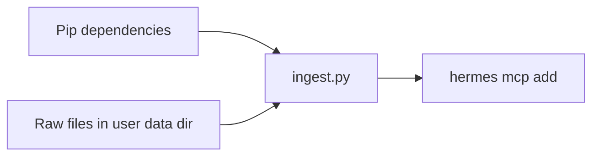

# LanceDB RAG-pijplijn activeren (handmatige terminalworkflow)

Dit document is de **in-repo** kopie van het activatieplan (Cursor-plan: *LanceDB RAG activeren*). Houd het hier bij voor versiebeheer; werk het bij wanneer de workflow wijzigt.

## Context

Scripts in deze map:

- `ingest.py` — orchestratie: scan, chunking, upsert, voortgang.
- `run_domains_ingest.py` — multi-domein uit `domains.yaml`, quarantaine-preflight, MCP-verify; `--ingest-remaining` (7 domeinen, skip leeg); `ingest_preflight.py`.
- `sync_profile_mcp_from_domains.py` — `mcp_servers` in alle profielen vanuit `domains.yaml`.
- `domains_config.py` — laadt domeinen + `media_policy`, `quarantine_restore`.
- `source_layout.py` — quarantaine terug naar canonieke paden.
- `ingest_run_summary.py` — eindrapport console + `rag_ingest_run_summary.json`.
- `source_formats.py` — centrale extensiematrix (plain / MarkItDown / media).
- `ingest_config.py` — uitsluitingen (`node_modules`, `~$*`, binaries); optioneel **`HERMES_RAG_MAX_FILE_MB`** (standaard **geen** limiet).
- `ingest_handlers.py` — MarkItDown + optionele **pandoc**-fallback voor legacy Office/OpenDocument.
- `ingest_state.py` — incrementele ingest (`mtime`/`size`/content-fingerprint) in `HERMES_LANCEDB_PATH/.hermes_rag_ingest_state.json`.
- `orphan_cleanup.py` — verwijdert oude chunk-`id`s na inkrimpen of verwijderen van een bron.
- `subtitle_sidecar.py` — `.vtt`/`.srt` vóór Whisper; geen dubbele index naast media.
- `audio_transcriber.py` — lokale audio/video via faster-whisper + ffmpeg.
- `mcp_server.py` — stdio MCP-server met tool `search_knowledge`.
- `kb_schema.py` — gedeeld `KnowledgeSchema` (velden **`id`**, `text`, `vector`, `source`), padconstanten en `list_all_table_names()` (LanceDB `list_tables()` API).
- `lancedb_maintenance.py` — multi-domein onderhoud uit `domains.yaml`: `--list`, `--inspect`, `--compact`, `--benchmark` (Windows: `windows/LANCEDB_MAINTENANCE.bat`).

**Idempotente upsert:** elke chunk krijgt een vaste **`id`** = SHA-256 van `(<relatief pad>\\0#<chunk-index>)`. **`merge_insert(..., on='id')`** werkt bestaande rijen bij. **Orphan cleanup** (standaard aan) verwijdert chunk-`id`s die niet meer in de nieuwste chunk-set van die bron zitten. **Incrementele ingest** (standaard aan) slaat ongewijzigde bronnen over via ingest-staat naast LanceDB.

### Omgevingsvariabelen (institutioneel)

| Variabele | Default | Betekenis |
| --------- | ------- | --------- |
| `HERMES_RAG_INCREMENTAL` | `1` | Alleen gewijzigde bronnen opnieuw indexeren |
| `HERMES_RAG_FORCE_FULL` | `0` | `1` = volledige scan (negeert incrementeel) |
| `HERMES_RAG_ORPHAN_CLEANUP` | `1` | Oude chunks per bron verwijderen na upsert |
| `HERMES_RAG_MAX_FILE_MB` | *(niet gezet)* | Geen limiet — **alle** bronnen. Zet bijv. `150` om bestanden boven 150 MB over te slaan |
| `HERMES_RAG_HASH_FULL_MAX_MB` | `32` | Volledige SHA-256 onder deze grootte; daarboven fingerprint |
| `HERMES_WHISPER_MODEL` | `medium` | faster-whisper model (kwaliteit; `large-v3` trager/nauwkeuriger) |
| `HERMES_RAG_PREFER_SIDECAR` | `1` | Sidecar wordt altijd eerst geprobeerd; deze vlag is legacy (zelfde gedrag) |
| `HERMES_RAG_SKIP_WHISPER_WITHOUT_SIDECAR` | **`1`** (safe) | Geen Whisper op media zonder sidecar; per domein `media_policy: whisper_when_missing` zet `0` |
| `HERMES_RAG_PERF_PROFILE` | **`safe`** | Preset: `safe` (institutioneel), `balanced`, `fast`, `off` — `rag_ingest_perf_defaults.ps1` |
| `HERMES_RAG_ALLOW_PARALLEL` | **`0`** | `1` = oude parallelle MarkItDown-golven (niet aanbevolen; kan hangen) |
| `HERMES_RAG_FILE_TIMEOUT_SEC` | **`1200`** (safe) / **`0`** (legal whisper) | Per bron totaal; `0` = geen limiet — live `[LIVE]` is leidend |
| `HERMES_RAG_CONVERT_WORKERS` | `2` (safe) | Alleen relevant bij `HERMES_RAG_ALLOW_PARALLEL=1` |
| `HERMES_RAG_EMBED_BATCH` | `32` (safe) | Embedding-batch; cap in ingest: `512` |
| `HERMES_RAG_CONVERT_HEARTBEAT_SEC` | `5` (safe) | Heartbeat bij parallelle modus |
| `HERMES_RAG_MAX_CHUNKS_PER_SOURCE` | `800` | Voorkomt geheugenproblemen bij enorme documenten |
| `HERMES_RAG_PYMUPDF_MAX_PAGES` | `80` | Max. PDF-pagina's voor PyMuPDF-fallback |
| `HERMES_RAG_GC_EVERY` | `10` | `gc.collect()` elke N bronnen (Windows/RAM) |
| `HERMES_RAG_VERBOSE` | `0` | `1` = uitgebreide regels per bestand; `0` = compact (balk + ✓/WARN) |
| `HERMES_RAG_PYMUPDF` | `1` | Na lege MarkItDown: PDF-tekstlaag via PyMuPDF (`pip install pymupdf`, zit in `[rag]`) |
| `HERMES_RAG_OCR` | `1` | Scans/beeld: Tesseract op PATH + `pip install pytesseract pillow` (optioneel) |
| `HERMES_RAG_OCR_LANG` | `nld+eng` | Tesseract-taal(pakketten) |
| `HERMES_RAG_CONVERT_TIMEOUT_SEC` | `300` | Timeout alleen conversie-stap (MarkItDown+OCR) |
| `HERMES_RAG_STATE_CHECKPOINT` | `25` | Ingest-staat wegschrijven elke N succesvolle bronnen |
| `HERMES_RAG_SKIP_REPORT` | *(LanceDB-map)* | JSON+MD-rapport overgeslagen bronnen (PDF/PNG-lijst) |

**Institutioneel (2026-05):** sequentiële verwerking per bron, live status `rag_ingest_live_status.json` met `run_state` (`running` / `completed` / `failed`), PID-check en reconciliatie (`ingest_live_status.py --reconcile`). Env-defaults centraal: `rag_institutional_defaults.py` + `docs/RAG_INSTITUTIONAL_ENV.md` (automatisch via `_rag_apply_institutional_env.bat` / `update_knowledge`). Log: **UTF-8 zonder BOM** (`run_rag_ingest.ps1` + `.editorconfig`).

**Live zichtbaarheid:** elke 3s `[LIVE] 12/1030 · 05:12 · MarkItDown · bestand.pdf` + postfix `⏳ 05:12 · stap · bestand` — zo zie je direct of een zware PDF nog loopt of vastzit (`HERMES_RAG_LIVE_TICK_SEC`, `HERMES_RAG_LIVE_LOG=0` om log-regels uit te zetten).

**Overgeslagen rapport:** na ingest `rag_ingest_skipped_report.json` + `.md` in de LanceDB-map. Achteraf: `windows\scripts\report_rag_skipped.bat` of `report_rag_skipped.py`.

**Eindrapport:** na elke run `rag_ingest_run_summary.json` + console-overzicht (gescand, geindexeerd, skips per reden, paden).

**Domeinbeleid (`%USERPROFILE%\data\domains.yaml`, voorbeeld `docs/domains.yaml.example`):**

- `quarantine_restore`: verplaatst `_PROBLEMATISCHE_BESTANDEN/*` vóór ingest naar canonieke paden.
- `media_policy: whisper_when_missing` + `media_ingest_env`: Whisper voor audio/video zonder sidecar (legal).
- Optioneel alleen media: `update_knowledge.bat legal --media-only`.

**0-byte verwijs-.txt:** stub-tekst uit bestandsnaam wordt wél geïndexeerd (Productie N → zie DEEL …).

**UI:** `ingest.py` toont een gouden voortgangsbalk `n/totaal` (zoals `install-J..ps1`). In een interactieve terminal; bij redirect naar log blijven tekstregels zichtbaar.

**Performance:** `update_knowledge.bat` roept `rag_ingest_perf_defaults.ps1` aan na conda-activate. Expliciet gezette env-variabelen worden **niet** overschreven. Taakplanner: `set HERMES_RAG_PERF_PROFILE=safe` of `set HERMES_NONINTERACTIVE=1` + `HERMES_RAG_FRESH=1`.

**Schema-upgrade:** bestond `knowledge_base` al **zonder** kolom `id`, dan stopt `ingest.py` met een foutmelding — eenmalig database wissen (**J** / `HERMES_RAG_FRESH=1`) of map handmatig verwijderen, daarna opnieuw indexeren.

**Paden:** `~/data/...` wordt op Windows `%USERPROFILE%\data\...` (niet automatisch je repo-schijf). Optioneel (institutioneel): zet **`HERMES_RAG_RAW_SOURCE`** en **`HERMES_LANCEDB_PATH`** (absolute paden of `~` / `%VAR%`) — zelfde variabelen lezen `ingest.py` en `kb_schema.py`; `windows\scripts\update_knowledge.bat` zet `HERMES_LANCEDB_PATH` vóór `python` gelijk aan de map die bij **J** wordt gewist.

**MCP-server:** start zonder crash ook als de database nog leeg is: ontbreekt `knowledge_base`, dan wordt een **lege** tabel met `KnowledgeSchema` aangemaakt. Voor echte antwoorden moet je daarna alsnog `ingest.py` draaien.

**Nieuw domein in domains.yaml:** `windows\LANCEDB_MAINTENANCE.bat --init-missing` (lege DB + schema) vóór eerste `update_knowledge.bat`.



## 100%-checklist (code vs. jouw run)

| # | Onderdeel | In repo (code) | Jouw run (verplicht voor E2E) |
| - | --------- | -------------- | ----------------------------- |
| 1 | CLI/Web bron-chips (`cli.py`, `web/…/Markdown.tsx`) | Ja — `[Bron: …]` → backticks | — |
| 2 | `pyproject.toml` extra `[rag]` | Ja — `pip install -e ".[rag]"` | Eenmalig in `hermes-env` |
| 3 | Automatische MCP + RAG-deps | Ja — `install-J..ps1` / `setup_hermes_windows.ps1` → `install_rag_extras.ps1` | Nieuwe sessie na install |
| 4 | `tests/rag_pipeline/` (pytest) | Ja | `pytest tests/rag_pipeline/ -q` |
| 5 | Rooktest (5 commando’s) | Ja — hieronder | Alle 5 stappen doorlopen |
| A | `update_knowledge.bat` tot einde | — | Log: `[OK] Ingestie-scan afgerond` |
| B | MCP + nieuwe Hermes-sessie | MCP in elk profiel (`domains.yaml`) | `update_knowledge.bat --mcp-test` OK |
| C | `search_knowledge` op bekende zin | — | Antwoord met `[Bron: …]` uit index |

Zonder **A+B+C** is de keten nooit 100% operationeel — ook niet met perfecte code.

## Institutioneel (P3 — mitigaties in repo)

| Risico | Mitigatie |
| ------ | --------- |
| conda vs. uv `.venv` | **Institutioneel:** alleen `conda hermes-env` (`HermesPythonPolicy.ps1`). Kapotte `.venv` → quarantaine; optioneel tweede interpreter met `HERMES_ALLOW_UV_VENV=1` |
| MCP per domein | `domains.yaml` → profiel **`mcp_servers:`** (sync: `sync_profile_mcp_from_domains.py`); verify via `--mcp-test` |
| Whisper/ffmpeg | `[rag]` bevat `faster-whisper`; **ffmpeg** moet op PATH (winget/choco) |
| Oud schema zonder `id` | `python scripts/rag_pipeline/schema_migrate.py` (inspect / `--backup-and-reset`) |
| Taakplanner wacht op J/N | `set HERMES_NONINTERACTIVE=1` of `HERMES_RAG_FRESH=0` vóór `update_knowledge.bat` |
| LanceDB-lock bij wissen | Waarschuwing in batch; sluit Hermes + MCP |
| Dev-repo vs. install-clone | `install_rag_extras.ps1` toont beide paden; werk in de checkout die je start |
| CI regressie | GitHub job `rag`: unit tests + `rag_integration` + `web/scripts/test-rag-citations.mjs` |
| `uv lock` met `[all,rag]` | **Niet combineerbaar** — `[rag]` gebruikt `markitdown==0.1.5`; daarna apart `pip install "markitdown[all]"`. `uv lock` voor `[dev,rag]` werkt wel (zie `uv.lock`). |
| Twee config-paden | Hermes kan `~/.hermes/config.yaml` **of** `%LOCALAPPDATA%\hermes\config.yaml` gebruiken — `which_hermes_repo.ps1` |
| Klikbare bron (P4) | `HERMES_RAG_BRON_FILE_LINKS=1` + `HERMES_RAG_RAW_SOURCE` → `[Bron: naam](file:///...)` |
| Watch-folder (P4) | `windows\scripts\watch_rag_sources.ps1` (debounce → `update_knowledge.bat`) |
| Gateway/Telegram chips | Web-dashboard: `Markdown.tsx`; messaging-platforms: nog geen bron-chips |

## Rooktest (5 commando’s, vanuit repo-root, conda `hermes-env`)

Alle commando’s in **één** geactiveerde shell; `cd` eerst naar de Hermes-repo-root (waar `scripts/` relatief klopt).

1. **Dependencies (eenmalig of na upgrade):**

   ```text
   pip install -e ".[rag]"
   ```

   Alternatief handmatig: `pip install lancedb sentence-transformers "markitdown[all]"` + `pip install mcp` (of `hermes-agent[mcp]`).

2. **Index bijwerken** (laat tot `[OK]` / einde lopen; bij grote media kan dit uren duren):

   ```text
   windows\scripts\update_knowledge.bat
   ```

   Of: `python scripts/rag_pipeline/ingest.py` met dezelfde env-variabelen als het batchbestand.

3. **MCP controleren** (per domein uit `domains.yaml`):

   ```text
   windows\scripts\update_knowledge.bat --mcp-test
   ```

   Of: `powershell -File windows\scripts\register_lancedb_mcp.ps1`

4. **Hermes per profiel:**

5. **Nieuwe Hermes-sessie + gerichte tool-vraag** (split-venster of `hermes` CLI):

   ```text
   Voer search_knowledge uit op de query 'VWO Elite' en citeer met [Bron: bestandsnaam].
   ```

   Verwachting: antwoord uit **lokale** index (rookbestand `test.txt` of jouw bronnen), niet een willekeurige marketingpagina van het web.

## Workflowtip: smoke-test

1. Map: `~/data/raw_source_files` (bijv. op Windows `%USERPROFILE%\data\raw_source_files`).
2. Bestand `test.txt` met bijvoorbeeld: *VWO Elite is een geavanceerd platform gebouwd door J. Het lanceert in 2026.*
3. Voer daarna de rooktest hierboven of de stappen hieronder uit.

## Bronbestanden: drie gouden regels

1. **Underscores i.p.v. spaties** in bestandsnamen (`wiskunde_b_…` i.p.v. `Wiskunde B …`) — minder verwarring bij citaten en paden in LLM-output.
2. **Korte, beschrijvende namen** — bijvoorbeeld `wiskunde_b_domein_c_differentiaalrekening.md` i.p.v. `samenvatting1.md`; de bestandsnaam (en pad) wordt als `source`-metadata in LanceDB opgeslagen en helpt vindbaarheid.
3. **Markdown waar mogelijk** — werk theorie bij voorkeur uit in `.md` met duidelijke `##` / `###` koppen; dat sluit aan op de semantische chunking. PDF, Word, PowerPoint, spreadsheets, `.msg` en HTML/XML worden via MarkItDown naar Markdown gezet; opgeschoonde bron-MD blijft ideaal voor maximale structuur.

## Ondersteunde bronbestanden (ingest)

Alles onder `~/data/raw_source_files` wordt per extensie gescand. **Autoritatieve lijst:** [`source_formats.py`](source_formats.py) (`PLAIN_SUFFIXES`, `MARKITDOWN_SUFFIXES`, `AUDIO_SUFFIXES`, `VIDEO_SUFFIXES`).

| Route | Extensies (samenvatting) |
| ----- | ------------------------ |
| **UTF-8 tekst** | `.txt`, `.md`, `.json`, `.jsonl`, `.log`, `.csv`, `.tsv`, `.yaml`, `.yml`, `.toml`, `.ini`, `.rst`, `.adoc`, ondertitels `.vtt`, `.srt`, `.sbv` |
| **MarkItDown → Markdown** | **Office:** `.docx`, `.doc`, `.docm`, `.dotx`, `.dotm`, `.rtf`, `.xlsx`, `.xls`, `.xlsm`, `.xlsb`, `.pptx`, `.ppt`, `.pptm`, `.ppsx`, `.pps`, `.msg`, `.eml` · **OpenDocument:** `.odt`, `.ods`, `.odp` · **Web/PDF:** `.pdf`, `.html`, `.htm`, `.xml`, `.rss`, `.atom` · **Overig:** `.epub`, `.ipynb`, `.zip` · **Beeld:** `.png`, `.jpg`, `.jpeg`, `.webp`, `.gif`, `.bmp`, `.tif`, `.tiff`, `.heic` |
| **Whisper + ffmpeg** | **Audio:** `.mp3`, `.m4a`, `.wav`, `.ogg`, `.flac`, `.aac`, `.wma`, `.aiff`, `.opus`, … · **Video:** `.mp4`, `.mov`, `.mkv`, `.webm`, `.avi`, `.wmv`, `.mpeg`, `.3gp`, … |

**Niet geïndexeerd (bewust):** binaries (`.exe`, `.dll`, …), databases (`.sqlite`, `.parquet`), archieven `.7z`/`.rar` (wel `.zip` via MarkItDown), Office-lock `~$*`, mappen `.git` / `node_modules` / `__pycache__`. **Grootte:** standaard geen maximum; optioneel `HERMES_RAG_MAX_FILE_MB=150` (of ander getal) om zeer grote bestanden over te slaan.

Voor **MarkItDown** is `pip install "markitdown[all]"` aanbevolen; voor legacy `.doc`/OpenDocument optioneel **`pandoc`** op PATH (fallback via `ingest_handlers.py`). Voor **media**: standaard **Whisper** (maximale transcriptie-kwaliteit uit de audio). `.vtt`/`.srt` alleen als Whisper ontbreekt/faalt, of expliciet `HERMES_RAG_PREFER_SIDECAR=1` (sneller, kan minder detail hebben). Bij conversiefouten: `[WARN]` en door.

## Windows: snelkoppeling (taakbalk)

Na setup of na **`windows\REFRESH_TASKBAR_SHORTCUTS.bat`** staat in **`hermes-agent\windows\`** o.a. **`Hermes - RAG kennis bijwerken - naar taakbalk slepen.lnk`** → **`windows\RAG_KNOWLEDGE_UPDATE.bat`** (roept `scripts\update_knowledge.bat` aan; per-domein via **`%USERPROFILE%\data\domains.yaml`**). Geplande nacht-run: **`RAG_KNOWLEDGE_UPDATE_NIGHT.bat`**.

**J/N:** **`HERMES_RAG_FRESH=j`** wist per domein de map uit `domains.yaml` (`lancedb/<domein>/`). **N** = incrementele upsert. Sluit Hermes/MCP vóór **J** (LanceDB-lock).

**Conda (geen hardcoded gebruikerspad):** het script zoekt `activate.bat` via **`HERMES_ACTIVATE_BAT`** (volledig pad), **`HERMES_CONDA_ROOT`**, of gangbare locaties onder `%USERPROFILE%` en `%LOCALAPPDATA%`. Omgevingsnaam standaard **`hermes-env`**; override met **`HERMES_CONDA_ENV`**.

## Stappen (eigen terminal, vanuit `hermes-agent` repo-root)

1. **Conda:** activeer `hermes-env` (prompt toont `(hermes-env)`), of bijvoorbeeld  
   `"%USERPROFILE%\miniconda3\Scripts\activate.bat" hermes-env`  
   (of het pad dat bij jullie hoort / `HERMES_CONDA_ROOT` uit `update_knowledge.bat`-logica).

2. **Werkdirectory:** `cd` naar de root van deze repo (waar `scripts/` relatief klopt).

3. **Dependencies:**

   ```text
   pip install -e ".[rag]"
   ```

   (Installeert o.a. `lancedb`, `sentence-transformers`, `markitdown[all]`, `pyarrow` en `mcp` via `pyproject.toml` extra `rag`.)

   **Fail fast:** `ingest.py` importeert `markitdown` statisch bovenaan. Ontbreekt het pakket, faalt het script direct bij start — niet pas na een lange scan.

4. **Ingestie:**

   ```text
   python scripts/rag_pipeline/ingest.py
   ```

5. **MCP per profiel** (Optie B): elk domein heeft `lancedb-<domein>` in `%LOCALAPPDATA%\hermes\profiles\<naam>\config.yaml` — zie `domains.yaml`. Aanmaken via `hermes profile create` + MCP-blok (setup doet dit). **Geen `model:` in profiel-yaml** — model komt uit root `%LOCALAPPDATA%\hermes\config.yaml` (`docs/PROFILE_MODEL_INHERITANCE.md`).

6. **Verifiëren:**

   ```text
   windows\scripts\update_knowledge.bat --mcp-test
   hermes -p legal mcp list
   ```

   Post-ingest draait MCP-verify automatisch. Start daarna een **nieuwe** Hermes-sessie per profiel. Zorg dat root-model/provider klopt (`hermes model`); profiel-config bevat alleen MCP-pad, geen apart model.

## Koppeling Hermes ↔ `search_knowledge` (waar het spaak loopt)

Als Hermes bij vragen over jouw lokale kennis toch **VWO.com / Google / curl** gebruikt in plaats van LanceDB, ligt dat meestal aan één van deze twee punten:

1. **Geen verse sessie na MCP-wijziging** — Hermes laadt de lijst met MCP-servers en hun tools **alleen bij het starten van een nieuwe sessie**. Een terminalpaneel dat blijft hangen, of Hermes zonder volledige herstart, kent `search_knowledge` dan nog niet.
2. **Te algemene prompt** — Bij zoiets als “Gebruik je knowledge base” kan het model **internet-zoektools** prefereren boven de MCP-tool. Voor een **onomstotelijke rooktest** moet je expliciet naar `search_knowledge` verwijzen.

### Oplossingsmatrix (split commandocentrum, o.a. `start_hermes_split.bat`)

1. **Sessie beëindigen** — In het Hermes-linkerpaneel: `/exit`, of het hele Windows Terminal-venster sluiten (geen “alleen tab sluiten” als je zeker wilt zijn dat het proces weg is).
2. **Opnieuw starten** — Dubbelklik opnieuw op `start_hermes_split.bat` (repo-root). Links start Hermes opnieuw; rechts volgt `Get-Content …\agent.log -Wait -Tail 30` (telemetrie/logstroom).
3. **Rechterpaneel in de gaten houden** — Bij een echte MCP-aanroep hoort er activiteit rond tooling / MCP in de log mee te lopen (exacte regels hangen van Hermes-versie en logniveau af).
4. **Gerichte controle-vraag** (minimale ruimte voor “verkeerde” tool-routing):

   ```text
   Voer een search uit met de tool search_knowledge op de query 'VWO Elite' en vertel me wat het is en wanneer het lanceert.
   ```

   Als sessie en ingestie kloppen, hoort het antwoord de **exacte zin uit `test.txt`** (rooktestdata) te bevatten — niet een algemene VWO-marketingpagina van het web.

## Changelog (technisch)

- `ingest_state.py`, `orphan_cleanup.py`, `subtitle_sidecar.py`, `ingest_handlers.py`: incrementele ingest, orphan cleanup, ondertitel-prioriteit, pandoc-fallback.
- `source_formats.py` + `ingest_config.py`: volledige Office/OpenDocument-dekking, media, ondertitels, uitsluitingen en max. bestandsgrootte; `ingest.py` importeert centrale sets.
- `ingest.py`: uitgebreide extensiematrix (Excel incl. `.xls`/`.xlsm`, PowerPoint `.pptx`, CSV, web `.html`/`.htm`, `.xml`, Outlook `.msg`); één MarkItDown-route via `_MARKITDOWN_SUFFIXES`.
- `ingest.py`: PDF en DOCX via **MarkItDown** (`MarkItDown().convert` → `text_content`); statische import (fail fast); overslaan bij lege conversie-output.
- `ingest.py`: semantische chunking i.p.v. vast woordvenster (koppen, `\n\n`, zinnen; code-fences; `DEFAULT_MAX_WORDS = 400`).
- `list_tables()` i.p.v. deprecated `table_names()` (via `list_all_table_names` in `kb_schema.py`).
- Sentence-transformers registry: `registry.create(name=...)` i.p.v. verwijderde `get_text_embedding_function`.
- MCP: ontbrekende `knowledge_base` → lege tabel met `KnowledgeSchema` (stderr-log, geen stdout die stdio JSON breekt).
