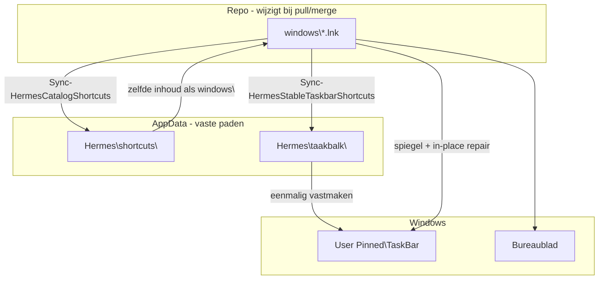

# Hermes — snelkoppelingen en taakbalk-pins (future-proof)

**Canonieke gids** voor alle `.lnk`-lagen op Windows. Andere docs verwijzen hierheen; wijzig gedrag in `HermesPersistentShortcuts.ps1`, niet los in markdown.

## Drie lagen (wie doet wat)

| Laag | Pad | In git? | Gebruik |
|------|-----|---------|---------|
| **Repo-bron** | `hermes-agent\windows\*.lnk` | Ja | Dubbelklik in Verkenner; generator/sync; lange namen (`Start Hermes - naar taakbalk slepen.lnk`) |
| **Persistente catalogus** | `%LOCALAPPDATA%\Hermes\shortcuts\` | Nee | Volledige kopie van catalogusnamen; backup van targets buiten repo |
| **Taakbalk-pin-bron** | `%LOCALAPPDATA%\Hermes\taakbalk\` | Nee | **Eénmalig** *Vastmaken aan taakbalk*; korte namen (`Hermes Start.lnk`, …) |



**Waarom niet direct uit `windows\` pinnen?** Slepen of vastmaken vanuit git maakt een kopie op de taakbalk. Na `UPDATE_HERMES`, merge of restore uit `backups\backup_*` worden repo-.lnk vernieuwd; oude pins → pop-up, dode knop of verkeerd icoon. De stabiele map ligt **buiten git**; `Repair-HermesTaskbarPinsFromStableDir` werkt **hetzelfde .lnk-bestand op de balk** bij (in-place).

## Rollen en bestandsnamen

| Rol | Dubbelklik (`windows\`) | Taakbalk vastmaken (`taakbalk\`) | `.bat` doel |
|-----|-------------------------|-----------------------------------|-------------|
| Start (full) | `Start Hermes - naar taakbalk slepen.lnk` | `Hermes Start.lnk` | `start_hermes.bat` |
| Start (snel) | `Start Hermes (snel) - naar taakbalk slepen.lnk` | `Hermes Start (snel).lnk` | `start_hermes_minimal.bat` |
| Update | `Hermes - update - naar taakbalk slepen.lnk` | `Hermes Update.lnk` | `UPDATE_HERMES.bat` |
| Setup | `Hermes - setup Windows - naar taakbalk slepen.lnk` | `Hermes Setup.lnk` | `SETUP_HERMES.bat` |
| Open Setup | `Hermes - Open Setup - naar taakbalk slepen.lnk` | `Hermes Open Setup.lnk` | `OPEN_SETUP.bat` |
| Backup | `Hermes - backup - naar taakbalk slepen.lnk` | `Hermes Backup.lnk` | `MANAGE_BACKUPS.bat` |
| Restore | `Hermes - lokale bestanden herstellen - naar taakbalk slepen.lnk` | `Hermes Herstellen.lnk` | `RESTORE_FROM_BACKUP.bat` |
| RAG | `Hermes - RAG kennis bijwerken - naar taakbalk slepen.lnk` | `Hermes RAG.lnk` | `RAG_KNOWLEDGE_UPDATE.bat` |
| Obsidian | `Hermes - Obsidian vault - naar taakbalk slepen.lnk` | `Hermes Obsidian.lnk` | `OPEN_OBSIDIAN_VAULT.bat` |

**Iconen:** goud = start/RAG, groen = setup, wit/zilver = update, roze = backup, cyaan = restore. Bron: `assets/Hermes_logo.png` → `windows/tools/generate_colored_hermes_icons.py`. Geen `hermes_taskbar_white.ico` in `.lnk`.

**Launcher:** alle `.lnk` → `wt.exe -M -d <repo> cmd /c call <pad.bat>` (RAG: `/k`). Geen `.bat` rechtstreeks naar taakbalk slepen.

## Eénmalig: taakbalk vastzetten

1. Open de stabiele map:

   ```bat
   windows\OPEN_HERMES_TAAKBALK_PINS.bat
   ```

2. In Verkenner: `%LOCALAPPDATA%\Hermes\taakbalk\`
3. Per gewenste rol: rechtsklik op `Hermes *.lnk` → **Vastmaken aan taakbalk**
4. **Niet** slepen uit `windows\` of `backups\backup_*`

Daarna hoef je bij normale updates **geen** pins te verwijderen.

## Automatisch (update + start)

`UPDATE_HERMES.bat`, `POST_GIT_PULL.bat` (pins) en `start_hermes.bat` (full) roepen `fix_hermes_taskbar_pins.ps1` → `Invoke-HermesShortcutSyncRepair`:

1. Icoonset indien nodig; cache `%LOCALAPPDATA%\Hermes\shortcut-icons\`
2. Vernieuwen `windows\*.lnk`
3. Sync naar `Hermes\shortcuts\` en `Hermes\taakbalk\`
4. `Repair-HermesTaskbarPinsFromStableDir` (bestaande pins in-place)
5. Spiegel `User Pinned\TaskBar` + reparatie legacy namen

## Handmatig herstellen

| Situatie | Actie |
|----------|--------|
| Icoon leeg / verkeerd pad | `windows\FIX_TASKBAR_ICONS.bat` → **F5** in Explorer |
| Na update + uitleg | `windows\OPEN_HERMES_TAAKBALK_PINS.bat` |
| Pop-up “Snelkoppeling beschadigd” | **Ja** → opnieuw vastmaken vanuit `taakbalk\` (niet uit `windows\`) |
| Oude exe-pin (bv. `hermes-hudui.exe`) | Losmaken van taakbalk; geen `.lnk` — niet door fix-keten |
| Verify | `scripts\verify_hermes_shortcut_paths.ps1 -IncludePinned -RepoRoot <repo>` |
| | `scripts\verify_taskbar_shortcut_icons.ps1 -RepoRoot <repo>` |

## Niet doen

- `.bat` rechtstreeks naar taakbalk slepen
- Pinnen vanuit `backups\backup_*\`
- Verwachten dat `windows\*-naar-taakbalk-slepen.lnk` op de balk eeuwig werkt zonder sync-keten
- `git reset --hard` op fork-`main` (wist NL/windows/RAG) — zie `UPSTREAM_SYNC.md`

## Gerelateerde entrypoints

| Script | Wanneer |
|--------|---------|
| `CREATE_DESKTOP_SHORTCUT.bat` | Bureaublad + vernieuwen `windows\` |
| `REFRESH_TASKBAR_SHORTCUTS.bat` | Alleen snelkoppelingen (subset onderhoud) |
| `HERMES_ONDERHOUD.bat` | Onderhoud incl. pins |
| `HERSTEL_TAAKBALK_POPUP.bat` | Korte route na kapotte-pin-pop-up |

Zie ook: [README.md](README.md) (troubleshooting), [UPSTREAM_SYNC.md](UPSTREAM_SYNC.md) (na Nous-merge), [START.md](START.md) (dagelijks starten), [INSTITUTIONAL.md](INSTITUTIONAL.md).
